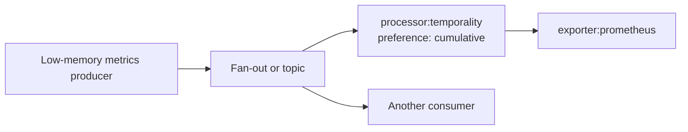

# RFC 0003: Metrics Temporality Processor

<!-- markdownlint-disable MD013 -->

**Status:** Draft

**Tracking issue:** [#3543](https://github.com/open-telemetry/otel-arrow/issues/3543)

**Related RFC:** [Native Prometheus Exporter](0004-prometheus-exporter.md)

**Processor URN:** `urn:otel:processor:temporality`

**Shortcut:** `processor:temporality`

**Primary telemetry metric set:** `processor.temporality.pdata`

**Initial stability:** Experimental

**Target node:** `crates/core-nodes/src/processors/temporality_processor/`

This RFC follows
[Reference-Informed OTAP-Native Capability Design](../ai/reference-informed-otap-native-capability-design.md).
The OpenTelemetry metrics data model, SDK exporter behavior, the Go Collector
Prometheus exporter and delta-to-cumulative processor, and the existing OTAP
temporal reaggregation processor are evidence. None of their implementation
structure is adopted mechanically.

## Summary

Add a native, metrics-aware processor that changes metric stream temporality
according to a downstream consumer preference. The first release accepts the
`cumulative` preference. It converts delta sums and classic histograms to
cumulative streams, validates and passes through already-cumulative streams
without retaining them, and preserves metric kinds that do not carry
aggregation temporality.

The processor separates the low-memory temporality chosen by a producer from
the temporality required by each consumer. This is particularly important for
the Internal Telemetry System (ITS), which emits the OpenTelemetry `lowmemory`
mix, while a Prometheus exporter requires cumulative sums and histograms. The
conversion belongs after fan-out so another consumer can continue to receive
the producer's original temporality.

V1 is deliberately a single-core processor. Temporal conversion is stateful:
every interval for one logical metric series must reach the same state owner in
order. The engine currently balances whole messages and does not provide
series-affinity routing. A one-core sink gives correct ownership now; a future
multi-core design requires a reusable series splitter and affinity router.

The processor owns conversion state but not retry storage. It stages one input
transaction, sends one downstream output, and commits the next conversion
state only after the output is Acked. A downstream Nack discards the staged
state and is propagated upstream with its permanence and cause. This avoids
double-counting without adding a private queue.

## Motivation

Metric producers and consumers make different temporality tradeoffs. A
low-memory producer avoids maintaining cumulative state for synchronous
counters and histograms. Prometheus, however, expects those streams in
cumulative form. A receiver-wide or producer-wide setting cannot serve both a
Prometheus branch and a backend that prefers delta data.

The intended composition is:



For multi-core producers feeding the initial single-core implementation, the
recommended deployment is:

```text
multi-core producers
    -> bounded balanced topic
    -> one-core sink pipeline
    -> processor:temporality
    -> exporter:prometheus
```

The topic is the shared bounded transport. It is not a conversion-state store,
and ordinary balanced delivery to several processor instances does not provide
series affinity.

## Goals

- Let each consumer branch select its required metrics temporality.
- Convert both OTLP-byte and OTAP-Arrow metrics through one semantic path.
- Preserve resource, scope, metric, point, attribute, timestamp, flag, and
  exemplar data not intentionally changed by conversion.
- Define deterministic start-time, reset, gap, overlap, duplicate, and
  histogram-layout behavior.
- Keep mutable conversion state local to one pipeline runtime.
- Bound persistent state, staging, message shape, and pending delivery work.
- Couple state commit to downstream Ack so retries cannot double-count.
- Reject unsupported or ambiguous input explicitly instead of dropping it or
  emitting representation-dependent results.
- Identify the routing contract required for safe multi-core generalization.

## Non-Goals

The first release does not provide:

- collection-frequency reaggregation;
- delta or `lowmemory` output preferences;
- temporal alignment or interpolation onto new time boundaries;
- aggregation across different logical series;
- durable conversion state across restart or live replacement;
- automatic insertion into a consumer's upstream graph;
- multi-core conversion without a series-affinity routing contract;
- a private retry queue or durable buffer;
- cumulative-to-delta exponential-histogram conversion;
- inference of an SDK instrument kind that is absent from received metric data.

## Evidence Base

The design is informed by:

- [issue #3543](https://github.com/open-telemetry/otel-arrow/issues/3543), which
  tracks consumer-selected temporality after ITS adopted the canonical
  low-memory representation;
- the [discussion on PR #3523](https://github.com/open-telemetry/otel-arrow/pull/3523),
  which separates low-memory production from optional downstream conversion;
- the [OpenTelemetry OTLP exporter temporality preferences](https://opentelemetry.io/docs/specs/otel/metrics/sdk_exporters/otlp/#additional-environment-variable-configuration);
- the [OpenTelemetry metrics data model](https://opentelemetry.io/docs/specs/otel/metrics/data-model/),
  including start times, resets, overlaps, and the single-writer principle;
- the local [data-model requirements](../model_requirements.md), which explain
  why downstream engines must handle pre-aggregated data from uncoordinated
  clocks and writers;
- the Go Collector
  [Prometheus exporter](https://github.com/open-telemetry/opentelemetry-collector-contrib/tree/main/exporter/prometheusexporter),
  which demonstrates useful delta-to-cumulative behavior but couples it to one
  exporter;
- the Go Collector
  [delta-to-cumulative processor at revision `edf9e9d`](https://github.com/open-telemetry/opentelemetry-collector-contrib/tree/edf9e9d98a4f6b175fa26549ca7db67ba38d5682/processor/deltatocumulativeprocessor),
  including its
  [documented behavior](https://github.com/open-telemetry/opentelemetry-collector-contrib/blob/edf9e9d98a4f6b175fa26549ca7db67ba38d5682/processor/deltatocumulativeprocessor/README.md),
  [configuration validation](https://github.com/open-telemetry/opentelemetry-collector-contrib/blob/edf9e9d98a4f6b175fa26549ca7db67ba38d5682/processor/deltatocumulativeprocessor/config.go),
  [processor lifecycle](https://github.com/open-telemetry/opentelemetry-collector-contrib/blob/edf9e9d98a4f6b175fa26549ca7db67ba38d5682/processor/deltatocumulativeprocessor/processor.go),
  [interval aggregation](https://github.com/open-telemetry/opentelemetry-collector-contrib/blob/edf9e9d98a4f6b175fa26549ca7db67ba38d5682/processor/deltatocumulativeprocessor/internal/delta/delta.go),
  [histogram arithmetic](https://github.com/open-telemetry/opentelemetry-collector-contrib/blob/edf9e9d98a4f6b175fa26549ca7db67ba38d5682/processor/deltatocumulativeprocessor/internal/data/add.go),
  and
  [timestamp tests](https://github.com/open-telemetry/opentelemetry-collector-contrib/blob/edf9e9d98a4f6b175fa26549ca7db67ba38d5682/processor/deltatocumulativeprocessor/testdata/timestamps/1.test);
- operational reports about
  [reverse-ordered points](https://github.com/open-telemetry/opentelemetry-collector-contrib/issues/46441),
  [empty exponential-histogram buckets](https://github.com/open-telemetry/opentelemetry-collector-contrib/issues/42163),
  [restart and replica continuity](https://github.com/open-telemetry/opentelemetry-collector-contrib/issues/47086),
  [synthetic reset points](https://github.com/open-telemetry/opentelemetry-collector-contrib/issues/45053),
  [periodic sparse-series re-emission](https://github.com/open-telemetry/opentelemetry-collector-contrib/issues/36485),
  and
  [stream-limit defaults](https://github.com/open-telemetry/opentelemetry-collector-contrib/issues/31603);
- the Go processor's
  [initial design discussion](https://github.com/open-telemetry/opentelemetry-collector-contrib/issues/30479),
  which also records the value of composing filtering and frequency changes
  from separate processors; and
- the existing
  [`processor:temporal_reaggregation`](../../crates/core-nodes/src/processors/temporal_reaggregation_processor/README.md),
  which provides OTAP-native state and Ack/Nack patterns but changes collection
  frequency rather than temporality.

## Reference Finding Classification

| Finding | Classification | OTAP-native decision |
| --- | --- | --- |
| ITS emits the specification-defined `lowmemory` mix | Preserve | Keep the producer cheap and convert after fan-out for consumers that require another preference. |
| Prometheus requires cumulative sums and histograms | Compose | Put this processor on the Prometheus branch; keep conversion out of the exporter. |
| The Go Prometheus exporter accumulates delta locally | Decompose | Move reusable temporality state into a processor with an explicit output contract. |
| The SDK selects temporality per consumer | Preserve/Adapt | Express the consumer choice as a pipeline processor because the dataflow engine has no `MetricReader`. |
| `processor:temporal_reaggregation` changes frequency | Preserve | Keep it separate; temporality conversion does not alter collection cadence. |
| Stateful conversion requires ordered ownership | Preserve/Improve | Require one core in V1 and define a series-affinity prerequisite for multi-core use. |
| Balanced routing distributes whole messages | Reject as affinity | A batch may contain many series and consecutive batches may reach different workers. |
| Exporter-local or producer-global temporality setting | Reject | It either duplicates conversion or prevents different consumer branches from selecting different preferences. |
| Shared cross-core accumulator | Reject | It violates share-nothing ownership and adds synchronization to the data path. |
| Ack before derived output is accepted | Reject | It can lose data or advance conversion state past a failed delivery. |
| The Go processor defaults to five-minute staleness and an effectively unbounded stream count | Preserve/Improve | Retain five minutes as a provisional expiration default, but enforce count and byte limits. Released numeric defaults require measurements. |
| The Go processor drops individual points on limit or aggregation errors and forwards the remainder | Reject | Validate and stage the entire input transaction; any failure emits nothing and Nacks the whole input. |
| The Go processor mutates conversion state before calling its consumer | Reject | Commit prospective state only after the derived output is Acked. |
| The Go processor accepts gaps and uses input point order | Improve | Treat gaps as resets and deterministically sort each series within one bounded message. Reject older points arriving in later messages. |
| The Go processor keeps conversion state only for delta streams | Preserve/Clarify | Cumulative input is shape-validated and passed through statelessly. A temporality change starts a new sequence. |
| Classic-histogram optional fields and exemplars need explicit accumulation rules | Improve | Use checked arithmetic, sticky absence for optional aggregate fields, and exemplars from only the current observation. |
| Exponential-histogram accumulation requires scale and sparse-bucket controls | Investigate | Stage it until common-scale downsampling, empty buckets, independent positive/negative growth, and bucket limits are specified and tested. |
| Synthetic reset values and periodic sparse-series re-emission are consumer-frequency concerns | Decompose | Leave them to the Prometheus scrape store or temporal reaggregation instead of fabricating observations here. |
| Per-component include/exclude selection | Compose | Use pipeline routing or filtering rather than adding another selector language. |
| Persistent conversion state for restart or replica failover | Investigate | Defer until durable ownership, recovery, and generation contracts are designed. |

## Declared Scope

### First useful release

V1 includes:

- `processor:temporality` registered in `core-nodes`;
- exactly one allocated core for the containing logical pipeline;
- the `cumulative` output preference;
- OTLP bytes and OTAP Arrow metrics traversed through generic `MetricsView`
  code;
- delta-to-cumulative conversion for monotonic and non-monotonic sums;
- delta-to-cumulative conversion for classic histograms;
- shape validation and stateless pass-through for cumulative sums, cumulative
  classic and exponential histograms, gauges, and summaries;
- bounded, deterministic per-series ordering within each input message;
- deterministic interval, reset, duplicate, and conflict handling;
- `NoRecordedValue` state retirement;
- bounded state and staging;
- downstream-Ack-driven atomic commit;
- representation-parity, component telemetry, tests, and benchmarks.

Delta exponential histograms are permanently unsupported in V1. Their scale,
zero-threshold, and bucket-layout transition rules need a separate
specification-aligned slice. The Go implementation shows that this slice must
cover common-scale downsampling, empty bucket sets, independent positive and
negative bucket growth, and hard bucket limits. An unsupported metric in a
metrics message rejects the whole transaction; it is never passed through in
violation of the processor's cumulative-output guarantee.

### Staged target capability

Follow-up slices may add:

1. delta exponential-histogram accumulation after compatible layout rules are
   specified;
2. the `delta` output preference, including documented information loss for
   the first cumulative observation and histogram min/max;
3. a meaningful `lowmemory` preference after the input model can distinguish
   the instrument kinds required by that SDK-defined mapping, or after a
   narrower pass-through meaning is standardized;
4. a reusable series-affinity splitter/router and multi-core processor mode;
5. generation-safe state transfer and resize; and
6. durable recovery or failover state after a storage and ownership contract
   is defined.

Until a slice lands, its preference or input combination is rejected during
configuration or with a permanent unsupported-input Nack.

## User-Facing Contract

### Configuration

Configuration is typed and denies unknown fields:

```yaml
type: processor:temporality
config:
  preference: cumulative
  state_expiration: 5m
  limits:
    max_series: 100000
    max_state_bytes: 256MiB
    max_staging_bytes: 32MiB
    max_data_points_per_message: 100000
    max_series_mutations_per_message: 10000
    max_attributes_per_series: 128
    max_histogram_buckets: 4096
```

The numeric and byte defaults are provisional. The configuration PR must
confirm them with representative memory and latency measurements before they
become a released contract.

| Field | Default | Contract |
| --- | --- | --- |
| `preference` | `cumulative` | V1 accepts only `cumulative`. `delta` and `lowmemory` remain reserved staged values and fail validation until implemented. |
| `state_expiration` | `5m` | Forget conversion state after no accepted update for this monotonic duration. A positive duration is required; `null` disables time retirement but not hard limits. The next delta after retirement starts a new cumulative sequence. |
| `limits.max_series` | `100000` | Maximum active delta-conversion series, including timestamp tombstones. Cumulative-only series consume no capacity. |
| `limits.max_state_bytes` | `256MiB` | Conservative budget for all owned delta-conversion identities, values, buckets, and indexes. |
| `limits.max_staging_bytes` | `32MiB` | Maximum transient state for one uncommitted input transaction and its output. |
| `limits.max_data_points_per_message` | `100000` | Maximum points examined in one input transaction. |
| `limits.max_series_mutations_per_message` | `10000` | Maximum state changes in the non-yielding final commit. |
| `limits.max_attributes_per_series` | `128` | Maximum resource, scope, and point attributes retained in one canonical identity. |
| `limits.max_histogram_buckets` | `4096` | Maximum explicit or exponential bucket entries in one point. |

Validation rejects unknown preferences, zero or inconsistent limits,
non-positive expiration, and a pipeline allocated other than exactly one core.
The resolved-pipeline single-core check must happen before any candidate worker
starts; a runtime `PipelineContext::num_cores()` check remains defense in depth.

### Output guarantee

For every Acked metrics input, every output sum or histogram with a defined
aggregation temporality is cumulative. Gauges and summaries are unchanged
because they do not carry aggregation temporality. Logs and traces pass through
unchanged.

The guarantee is based on the output payload, not on a provenance marker. A
consumer must continue validating the actual temporality it receives because
misconfigured, custom, or future components can bypass this processor.

## OTAP-Native Architecture

### Processor actor and transaction

One pipeline-local `!Send` actor owns conversion state and one pending
transaction. For each metrics message it:

1. creates a representation-neutral view, validates bounded shapes and
   identities, and orders observations per series;
2. stages one bounded output and prospective state change;
3. subscribes to downstream Ack/Nack and sends one output;
4. stops accepting pdata while continuing to service completion and control;
5. commits and Acks the original only after downstream Ack; or
6. discards the staged state and propagates a downstream Nack unchanged.

The fixed one-pending-transaction rule is deliberate V1 simplicity. It avoids
speculative chains whose later cumulative values depend on an output that may
still fail. The bounded engine inbox and downstream component apply
backpressure; the processor does not add a waiting queue.

No-op metrics messages that are already cumulative may reuse and forward the
original pdata after shape validation. A message containing any converted
point is rebuilt once as OTAP Arrow metrics so converted and unchanged metrics
retain one downstream completion. The rebuilt message preserves all data
unrelated to temporality. If the current views or builders cannot represent a
field losslessly in both OTLP and OTAP paths, the processor permanently Nacks
the message rather than dropping or stringifying it.

### Conversion-state identity

State keys are structural, never delimiter-concatenated strings. A logical
series identity includes:

- resource schema URL and attributes;
- instrumentation scope schema URL, name, version, and attributes;
- metric name, kind, unit, and monotonicity;
- sorted point attributes.

The identity excludes aggregation temporality, start/end timestamps, values,
flags, exemplars, and histogram bucket layout. Those fields describe an
observation or a transition of the same logical stream and must reach the same
state owner so conflicts can be detected.

Lookup may use a stable hash, but equality is structural. The same semantic
OTLP and OTAP series produces the same identity. User-controlled identity
values never appear in component metric dimensions or diagnostic events.

Each active delta-conversion series retains only the state needed to derive the
next observation: cumulative sequence start, last accepted end, cumulative
value or buckets, histogram layout and optional-field presence, the last
interval fingerprint for idempotence, and monotonic arrival time for
retirement. Cumulative-only series retain no state.

### Metric behavior

| Input metric | V1 cumulative preference |
| --- | --- |
| Gauge | Validate and pass through unchanged. |
| Cumulative monotonic sum | Validate shape and pass through without conversion state. |
| Cumulative non-monotonic sum | Validate shape and pass through without conversion state. |
| Delta monotonic sum | Accumulate into a cumulative sum. |
| Delta non-monotonic sum | Accumulate signed deltas into a cumulative non-monotonic sum. |
| Cumulative classic histogram | Validate shape and pass through without conversion state. |
| Delta classic histogram | Add count and compatible buckets with checked arithmetic; combine optional aggregate fields only while present in every contributing delta. |
| Cumulative exponential histogram | Validate shape and pass through without conversion state. |
| Delta exponential histogram | Permanent unsupported-input Nack in V1. |
| Summary | Validate and pass through unchanged. |
| Unspecified/unknown temporality or data kind | Permanent unsupported-input Nack. |

All points in a metric are processed. Within one message, observations are
grouped by canonical series identity and sorted by end timestamp, start
timestamp, and original position. Exact repeats are idempotent; equal intervals
with different content are conflicts. Sorting is bounded by the message and
staging limits. The processor does not reorder across messages, so an older
interval arriving later is permanently Nacked.

A message containing a mixture of valid and invalid streams commits and emits
nothing when any stream fails.

### Interval, reset, and duplicate rules

Delta points require non-zero start and end timestamps with start before end.
For a new or retired series, the first valid delta seeds a cumulative sequence:
its output start is the delta start and its output value is the delta value.

For an existing sequence:

- a delta whose start equals the previous end is accumulated;
- an exact repeat of the last interval and content is idempotent and re-emits
  the same cumulative result without adding twice;
- a start after the previous end is a gap/reset and seeds a new sequence;
- an overlap, backwards interval, or equal interval with different content is
  a permanent alignment/conflict Nack;
- classic histogram addition requires identical explicit bounds within one
  sequence and cannot overflow counts;
- a layout change is accepted only as a non-overlapping new sequence;
- an arithmetic or representation overflow permanently rejects the message.

For a classic histogram, explicit bounds must remain identical within a
sequence. Bucket counts, when present, must have exactly one more entry than
the bounds. Count and bucket arithmetic is checked. Optional bucket counts,
sum, min, and max remain in the cumulative result only while every contributing
delta supplies the corresponding field; absent data is never fabricated.
Minima and maxima are combined across the sequence. Point flags and exemplars
come only from the current observation, so old exemplars are not replayed.

Cumulative points receive point-local and shape validation and otherwise pass
through unchanged. V1 does not retain a cumulative baseline or promise
cross-message ordering validation for cumulative-only streams.

A change in aggregation temporality always begins a new sequence. A cumulative
observation newer than an active delta accumulator supersedes that accumulator
without combining their values; removal commits only after downstream Ack. A
cumulative observation that is not newer is a permanent stale/conflict Nack.
A later delta seeds a new sequence from its own interval and value. Pure
cumulative streams never consume state capacity.

A newer `NoRecordedValue` point for an active delta-conversion series removes
its accumulator and emits the flag downstream. A bounded tombstone prevents an
older delayed delta from resurrecting the sequence. A valid delta newer than
the tombstone starts a new cumulative sequence and replaces it; if the
tombstone expires first, the next valid delta also starts a new sequence.
`NoRecordedValue` on a cumulative-only series passes through without creating
processor state.

### Bounds and retirement

Delta-conversion state, staging, identities, buckets, indexes, and tombstones
are accounted conservatively. Expiration runs independently of traffic in
bounded chunks and uses monotonic arrival time, not event timestamps.

Capacity is evaluated against the prospective final state. Updates or removals
may still commit when the current store is at a limit if their final state fits.
A transaction that cannot fit returns a retryable capacity Nack without state
mutation or output. A message exceeding a fixed shape or staging limit returns
a permanent oversized-input Nack because retrying it unchanged cannot satisfy
the contract.

Retirement is semantically visible: forgetting a delta accumulator means its
next observation begins a new cumulative sequence and downstream consumers may
observe a reset. The component counts these events without identifying the
customer series.

## Series-Affinity Routing

### Why V1 requires one core

A logical pipeline assigned several cores creates several independent
processor instances. Current `one_of` connections and balanced topics choose a
destination for a whole pdata message. They do not hash individual metric
series, and two consecutive batches for one series can reach different cores.
Local accumulators would then each see partial history and emit incorrect
cumulative values.

Hashing a whole message is not sufficient because one metrics message can
contain series that belong to different shards. Hashing only a resource or
metric name is also insufficient because it creates avoidable hotspots and may
still merge distinct writers.

The one-core sink used by the Prometheus exporter already provides the required
ownership. Multi-core producers may fan in through one balanced-topic receiver;
there is then only one conversion state owner.

### Future reusable routing contract

Safe multi-core conversion requires a reusable routing facility that:

- traverses OTLP and OTAP metrics through the same canonical series identity;
- splits a message by logical series while preserving resource and scope data;
- routes every interval for a series to the same shard;
- preserves per-series ordering and applies bounded backpressure;
- aggregates shard Ack/Nack outcomes back to the original message;
- handles retry of already-committed shards idempotently;
- defines whether cross-shard input atomicity is provided or intentionally
  replaced by documented idempotent partial commit;
- keeps the hash/version stable for a deployment generation; and
- rejects resize or performs explicit state transfer before changing the shard
  mapping.

This should be an engine or reusable routing capability, not logic hidden in
the temporality processor. Until that contract exists, multi-core allocation
and an operator assertion of affinity are rejected.

## Backpressure and Ack/Nack Contract

| Condition | Result |
| --- | --- |
| Metrics message validates, derived output is Acked, and state commits | Ack original input after commit. |
| Downstream returns Nack | Discard staged conversion state and propagate the same permanence, cause, and reason. |
| Unsupported preference, metric kind, or temporality | Permanent Nack; no output or mutation. |
| Invalid interval, layout, shape, or single-writer conflict | Permanent Nack; no output or mutation. |
| Message or staging limit exceeded | Permanent oversized-input Nack; no output or mutation. |
| Conversion state capacity exhausted | Retryable capacity Nack; no output or mutation. |
| Internal invariant or state corruption | Fail the node and pipeline instance; do not Ack. |

The processor has no internal retry loop. Place reusable retry or durable
buffer components according to their documented Ack contract. For the
Prometheus composition, placing this processor before downstream retry keeps
retries operating on one already-derived cumulative output while the converter
waits for its terminal outcome.

Tracked-topic hops must preserve Ack/Nack permanence and cause for this direct
contract to remain exact end to end. Until that engine capability is present,
the full classification is guaranteed only on direct pipeline hops.

## Lifecycle and Live Reconfiguration

Startup validates configuration, the one-core deployment constraint, and
allocates empty bounded state. The processor starts accepting pdata only after
its downstream route is ready under the engine's normal sink-first startup
contract.

During normal shutdown, the actor resolves or Nacks its single pending
transaction by the node deadline, reports final telemetry, and drops its
in-memory state. There is no persistence flush. Forced abort retains the
engine's existing limitation that an in-flight pdata may receive no terminal
completion.

A no-op live update preserves the running instance and state. Any replacement
starts with empty conversion state and is an observable reset for later delta
input. V1 rejects resize above one core and singleton core movement. Seamless
replacement or resize requires explicit state-transfer and series-affinity
generation contracts. The one-core ownership model also does not provide
conversion continuity across process restart or replica failover; durable
recovery remains a future storage and ownership design.

## Security and Privacy

Metric identities and values are untrusted, potentially sensitive data.

- Every persistent and transient allocation is bounded.
- Hashing is resistant to adversarial collision while equality remains
  structural.
- Logs, events, and metric dimensions never include metric names, attributes,
  resource values, point values, or exemplars.
- Diagnostic reason categories are fixed low-cardinality enums.
- Malformed input cannot cause partial state mutation or partial output.
- All internal events use the `otel_*` telemetry macros.

## Component Telemetry

The primary metric set is `processor.temporality.pdata`. Reuse standard
processor pdata metrics where their semantics are exact, and add
low-cardinality fields for:

- input messages and points validated;
- messages and points converted or passed through;
- downstream-Acked transactions;
- permanent invalid, unsupported, and alignment rejections;
- retryable capacity rejections;
- active series, tombstones, and accounted state bytes;
- resets caused by gaps, explicit start changes, retirement, or
  `NoRecordedValue`;
- message-local reordering and cross-message late-point conflicts;
- idempotent duplicate intervals;
- downstream Nacks by fixed permanence/cause category; and
- state-expiration work and duration.

An input is counted as successfully converted only after its downstream output
is Acked and the staged state commits. Events cover capacity pressure,
alignment-conflict summaries, state reset, replacement reset, and shutdown
deadline expiry without customer-controlled fields.

## Validation Plan

### Direct semantic tests

- First, contiguous, duplicate, gap, overlap, backwards, missing-timestamp, and
  equal-time transitions for integer and double sums.
- Reverse-chronological points within one message produce the same result as
  chronological input; an older point in a later message is permanently
  Nacked.
- Monotonic and non-monotonic delta-to-cumulative sums.
- Classic histogram count and bucket overflow, malformed bucket shapes, bound
  changes, sticky optional bucket/sum/min/max absence, and current-observation
  exemplars.
- Cumulative input passes through without state or capacity use.
- A cumulative observation after active delta state retires that state only
  after Ack; a later delta starts a new sequence.
- `NoRecordedValue`, tombstone ordering, expiration, and reset after retirement.
- Unsupported or unspecified temporality and delta exponential histograms.
- Atomic mixed-message rejection proving no output and byte-for-byte unchanged
  committed state.
- Capacity, staging, shape, and commit-mutation limits.
- Downstream Ack commits exactly once; permanent and retryable Nacks roll back
  and preserve status/cause.
- Shutdown with no pending transaction and with one pending output.

Every unit test follows the project's `Scenario:` and `Guarantees:` convention.

### Representation parity

Equivalent OTLP bytes and OTAP Arrow inputs must produce the same canonical
state and semantically identical output. No-op cumulative input may retain its
original representation; converted output is compared through semantic views.

Fuzz malformed protobuf, missing Arrow batches, extreme timestamps and values,
duplicate points, attribute identities, histogram layouts, and messages near
every bound. Unsupported fields must fail identically rather than being dropped
on one representation path.

The future delta exponential-histogram slice must add direct tests for empty
bucket sets, common-scale downsampling, and independent positive and negative
bucket growth before it can leave the unsupported set.

### Runtime and integration tests

- Processor harness coverage for input gating, Ack/Nack, cancellation, control
  responsiveness, and terminal telemetry.
- One-core ITS low-memory metrics through the temporality processor to the
  Prometheus exporter, verifying cumulative counter and histogram scrapes.
- A branch where the Prometheus path converts to cumulative while a second
  consumer receives the original temporality.
- Multi-core producers through a balanced topic into one one-core conversion
  sink.
- Pre-launch rejection of multi-core allocation and live resize/core movement.
- Sustained high-cardinality churn proving a memory plateau and bounded
  expiration work.
- Benchmarks for identity construction, sum/histogram conversion, staging,
  state lookup, and the largest permitted commit.

## Alternatives Considered

### Extend `processor:temporal_reaggregation`

Rejected. Reaggregation changes collection frequency and buffers observations
until a timer. Temporality conversion changes the representation of each
logical stream for a consumer. Combining both creates coupled configuration,
state, delivery, and failure semantics. The implementations may share audited
identity or builder utilities later.

### Convert inside each exporter

Rejected. It duplicates start-time, reset, state-limit, and retry correctness
across exporters and prevents reuse by any consumer that requires a different
temporality.

### Configure ITS or a receiver to emit cumulative globally

Rejected. It increases producer memory and cannot simultaneously serve
consumer branches that prefer the original low-memory or delta representation.

### Use one shared cross-core conversion store

Rejected. It adds synchronization and cross-thread wakeups to the data path,
conflicts with share-nothing pipeline ownership, and obscures backpressure.

### Allow multi-core with an operator affinity assertion

Rejected. Current routing cannot verify the assertion, batches may contain
several series, and live resize can silently change ownership. Incorrect
cumulative values are worse than an explicit configuration failure.

### Implement all temporality preferences in V1

Deferred. Cumulative output satisfies the first Prometheus/ITS scenario.
Cumulative-to-delta and `lowmemory` need additional information-loss and
instrument-kind contracts that should not delay that path.

### Accept missing delta timestamps or infer continuity across gaps

Deferred. V1 targets ITS input with valid delta intervals. Missing start or end
timestamps are ambiguous, while a gap is an observable reset under the metrics
data model. Supporting degenerate timestamp cases requires a separate,
specification-aligned contract.

### Emit synthetic reset points or periodically repeat sparse series

Rejected. Those behaviors alter observation cadence and can invent timestamps
or values. Compose the Prometheus scrape store or
`processor:temporal_reaggregation` when a consumer needs them.

### Add include/exclude selectors

Rejected. Compose existing routing or filtering facilities so selection
semantics are not duplicated in this stateful processor.

### Persist conversion state in V1

Deferred. Persistence alone does not define single-writer ownership, replica
takeover, or safe generation changes. Those contracts require a separate
durable-recovery design.

## Compatibility and Migration

Pipelines already producing cumulative metrics do not require this processor.
If cumulative input traverses it, the input passes through without consuming
conversion-state capacity. Low-memory or delta producers add it only on
consumer branches that require cumulative data. The Prometheus exporter does
not gain a temporality setting; it validates its cumulative input contract
directly.

The new processor does not change `processor:temporal_reaggregation`. Pipelines
using both place temporality conversion according to the final consumer
requirement and follow the reaggregation processor's existing batching/retry
placement guidance. Temporality changes are sequence boundaries, not a way to
continue an accumulator from a cumulative baseline.

## Staged PR Plan

1. Land this RFC and the corresponding Prometheus exporter RFC update.
2. Add any shared, lossless view/builder and single-core deployment
   prerequisites.
3. Implement bounded cumulative conversion with transactional Ack/Nack tests.
4. Add ITS-to-Prometheus integration, benchmarks, documentation, and the
   user-facing changelog entry.
5. Add other preferences and multi-core affinity only through separate RFC
   amendments.

Each implementation PR remains focused on one behavioral concern.
