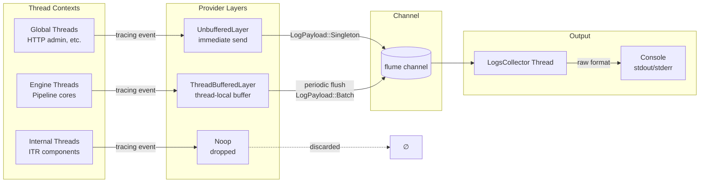
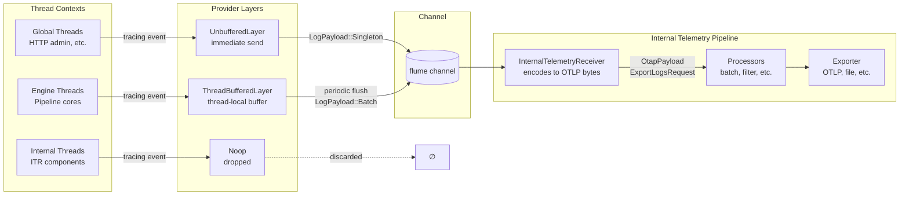

# Internal Telemetry Logging Pipeline

This documents the choices available in the internal logging
configuration object in
`otap_df_config::pipeline::service::telemetry::logs`. See the
[internal telemetry crate's README](../crates/telemetry/README.md) for
the motivation behind this configuration as well as for a description
of the internal metrics pipeline.

## Overview

The internal telemetry SDK is designed for the engine to safely
consume its own telemetry, and we intend for the self-hosted telemetry
pipeline to be the standard configuration for all OpenTelemetry
signals.

Consuming self-generated telemetry presents a potential
feedback loop, situations where a telemetry pipeline creates pressure
on itself. We have designed for the OTAP dataflow engine to remain
reliable even with this kind of dependency on itself.

## Internal telemetry receiver

The Internal Telemetry Receiver or "ITR" is an OTAP-Dataflow receiver
component that receives telemetry from internal sources and sends
sends to an internal telemetry pipeline. An internal
telemetry pipeline consists of one (global) or more (NUMA-regional)
ITR components and any of the connected processor and exporter
components reachable from ITR source nodes.

## Logs instrumentation

The OTAP Dataflow engine has dedicated macros, and every component is
configured with an internal telemetry SDK meant for primary
instrumentation. Using the `otel_info!(effect, name, args...)` macro
requires access the component EffectHandler. This is considered
first-party internal logging, and other uses of Tokio `tracing` are
considered third-party internal logging.

## Pitfall avoidance

The OTAP-Dataflow engine is safeguarded against many self-induced
telemetry pitfalls, as follows:

- OTAP-Dataflow components reachable from an ITR cannot be configured
  to send to an ITR node. This avoids a direct feedback cycle for
  internal telemetry because the components cannot reach
  themselves. For example, ITR and downstream components may be
  configured for raw logging.
- Use of dedicated thread(s) for internal telemetry output.
- Thread-local state to avoid third-party instrumentation in
  dedicated internal telemetry threads.
- Components under observation (non-ITR components) use
  per-engine-core internal logs buffer, allowing overflow.
- Non-blocking interfaces. We prefer to drop and count dropped
  internal log events than to block the pipeline.
- Option to configure internal telemetry multiple ways, including the
  no-op implementation, global or regional logs consumers, buffered and
  unbuffered.

## OTLP-bytes first

As a key design decision, the OTAP-Dataflow internal telemetry data
path produces a partially encoded OTLP-bytes representation first.
This is an intermediate format,
`otap_df_telemetry::self_tracing::LogRecord` which include the
timestamp, callsite metadata, and the OTLP bytes encoding of the body
and attrbutes.

Because OTLP bytes is one of the builtin `OtapPayload` formats, it is
simple to get from a slic of `LogRecord` to the `OtapPayload` we need
to consume internal telemetry.  To obtain the partial bytes encoding
needed, we have a custom [Tokio `tracing` Event][TOKIOEVENT] handler
based on `otap_df_pdata::otlp::common::ProtoBuffer`.

[TOKIOEVENT]: https://docs.rs/tracing/latest/tracing/struct.Event.html

## Raw logging

We support formatting events for direct printing to the console from
OTLP bytes. For the dynamic encoding, these are consumed using
`otap_df_pdata::views::logs::LogsDataView`, making the operation
zero-copy. We refer to this most-basic form of printing to the console
as raw logging because it is a safe configuration that avoids feedback
for internal logging.

Note: Raw logging is likely to introduce contention over the console.

In cases where internal logging code is forced to handle its own
errors, the `otap_df_telemetry::raw_error!` macro is meant for
emergency use, to report about failures to log.

## Logging provider modes

The logging configuration supports multiple distinct provider mode
settings:

- Global: The default Tokio subscriber, this will apply in threads
  that do not belong to an OTAP dataflow engine core.
- Engine: This is the default configuration for engine core threads.
- Internal: This is the default configuration for internal telemetry
  pipeline components.

Provider mode values are:

- Noop: Ignore these producers
- Unbuffered: Use a non-blocking write to the internal logs channel.
  Unbuffered is the default for the global provider.
- Buffered: Use a thread-local buffer, requires managed flushing.
  The global provider is not supported for buffered logging.
- OpenTelemetry: Use the OpenTelemetry SDK. This option has the most
  comprehensive obsevability, including OpenTelemetry traces
  integration.
- Raw: Use the raw logger, meaning to synchronously write to the
  console. For asynchronous console logging instead, use Buffered or
  Unbuffered provider mod and set the Raw output mode.

## Output modes

When any of the providers use Buffered or Unbuffered modes, an
engine-managed thread is responsible for consuming internal logs. This
`LogsCollector` thread is currently global, but could be NUMA-regional
as described in [README](./README.md), and it can be configured currently
for raw or internal logging.

The output modes are:

- Noop: Not a real output mode, this setting will cause an error when
  any provider uses Buffered or Unbuffered.
- Raw: Use raw console logging from the global or regional logging
  thread.
- Internal: Use an Internal Telemetry Receiver as the destination.

## Default configuration

In this configuration, a dedicated `LogsCollector` thread consumes
from the channel and prints to console.

```yaml
service:
  telemetry:
    logs:
      level: info
      providers:
        global: unbuffered
        engine: buffered
        internal: noop
      output: raw
```



## Internal Telemetry Receiver configuration

In this configuration, the `InternalTelemetryReceiver` node consumes
from the channel and emits `OtapPayload::ExportLogsRequest` into the
pipeline.

```yaml
service:
  telemetry:
    logs:
      level: info
      providers:
        global: unbuffered
        engine: buffered
        internal: noop
      output: internal

nodes:
  internal_telemetry:
    kind: receiver
    plugin_urn: "urn:otel:otlp:telemetry:receiver"
    out_ports:
      out_port:
        destinations:
          - otlp_exporter

  otlp_exporter:
    kind: exporer
    ...
```


