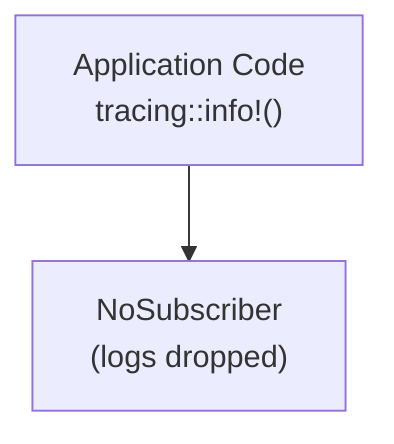
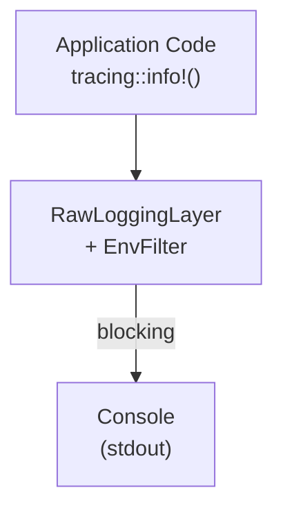
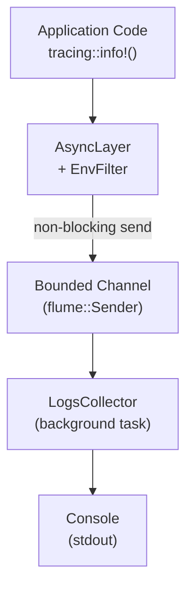
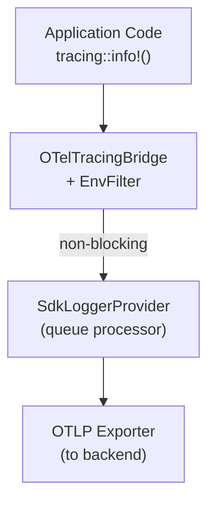
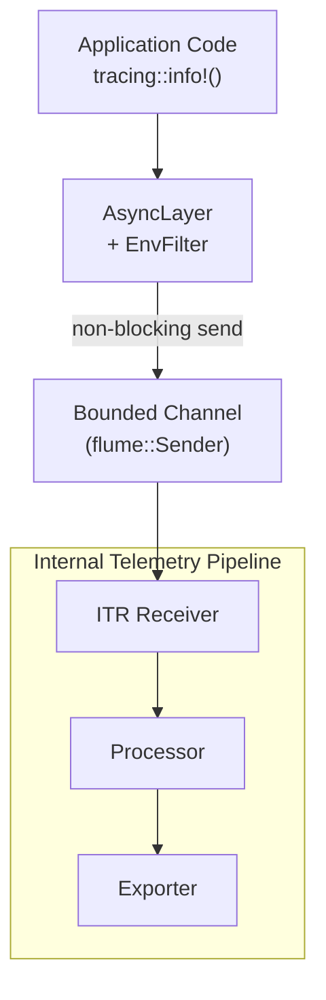
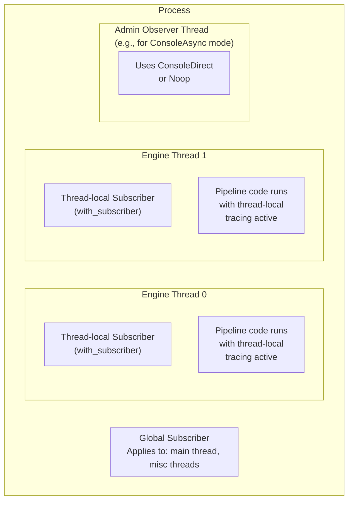

# Internal Telemetry Logging Pipeline

This documents the choices available in the internal logging
configuration object in
`otap_df_config::settings::telemetry::logs`. See the
[internal telemetry crate's README](../crates/telemetry/README.md) for
the motivation behind this configuration as well as for a description
of the internal metrics pipeline.

## Overview

The internal telemetry SDK is designed for the engine to safely
consume its own telemetry, and we intend for the self-hosted telemetry
pipeline to be the standard configuration for all OpenTelemetry
signals.

Consuming self-generated telemetry presents a potential
feedback loop, situations where a telemetry pipeline creates pressure
on itself. We have designed for the OTAP dataflow engine to remain
reliable even with this kind of dependency on itself.

## Internal Telemetry Receiver (ITR)

The Internal Telemetry Receiver or "ITR" is an OTAP-Dataflow receiver
component that receives telemetry from internal sources and sends
to an internal telemetry pipeline. An internal
telemetry pipeline consists of one (global) or more (NUMA-regional)
ITR components and any of the connected processor and exporter
components reachable from ITR source nodes.

Nodes of an internal telemetry pipeline have identical structure with
ordinary pipeline nodes, however they are separate and isolated. The
main dataflow engine knows nothing about the internal telemetry
pipeline engine.

## Logs instrumentation

The OTAP Dataflow engine has dedicated macros, and every component is
configured with an internal telemetry SDK meant for primary
instrumentation. Using the `otel_info!(effect, name, args...)` macro
requires access the component EffectHandler. This is considered
first-party internal logging, and other uses of Tokio `tracing` are
considered third-party internal logging.

## Pitfall avoidance

The OTAP-Dataflow engine is safeguarded against many self-induced
telemetry pitfalls, as follows:

- OTAP-Dataflow components reachable from an ITR cannot be configured
  to send to an ITR node. This avoids a direct feedback cycle for
  internal telemetry because the components cannot reach
  themselves.
- Use of dedicated thread(s) for internal telemetry output.
- Control over Tokio `tracing` subscriber in different contexts
- Non-blocking interfaces. We prefer to drop and count dropped
  internal log events than to block the pipeline.
- Option to configure internal telemetry multiple ways, including the
  no-op implementation, direct console output, and global or regional
  logs consumers.

## OTLP-bytes first

As a key design decision, the OTAP-Dataflow internal telemetry data
path produces a partially encoded OTLP-bytes representation first.
This is an intermediate format,
`otap_df_telemetry::self_tracing::LogRecord` which include the
timestamp, callsite metadata, and the OTLP bytes encoding of the body
and attrbutes.

Because OTLP bytes is one of the builtin `OtapPayload` formats, it is
simple to get from a slic of `LogRecord` to the `OtapPayload` we need
to consume internal telemetry. To obtain the partial bytes encoding
needed, we have a custom [Tokio `tracing` Event][TOKIOEVENT] handler
based on `otap_df_pdata::otlp::common::ProtoBuffer`.

[TOKIOEVENT]: https://docs.rs/tracing/latest/tracing/struct.Event.html

## Raw logging

We support formatting events for direct printing to the console from
OTLP bytes. For the dynamic encoding, these are consumed using
`otap_df_pdata::views::logs::LogsDataView`, making the operation
zero-copy. We refer to this most-basic form of printing to the console
as raw logging because it is a safe configuration that avoids feedback
for internal logging.

Note: Raw logging is likely to introduce contention over the console.

In cases where internal logging code is forced to handle its own
errors, the `otap_df_telemetry::raw_error!` macro is meant for
emergency use, to report about failures to log.

## Logging provider modes

The logging configuration supports multiple distinct provider mode
settings:

- Global: The default Tokio subscriber, this will apply in threads
  that do not belong to an OTAP dataflow engine core.
- Engine: This is the default configuration for engine core threads.
- Admin: This is the configuration use in administrative threads.
- Internal: This is the default configuration for internal telemetry
  pipeline components.

Provider mode values are:

- Noop: Ignore logging.
- ITS: Use the internal telemetry system.
- OpenTelemetry: Use the OpenTelemetry SDK.
- ConsoleDirect: Synchronously write to the console.
- ConsoleAsync: Asynchronously write to the console.

Note that the ITS and ConsoleAsync modes share a the same provider
logic, which writes to an internal channel. These modes differ in how
the channel is consumed.

## Provider Mode Diagrams

### Noop Provider

Logs are silently dropped. Useful for testing or disabling logging.



### ConsoleDirect Provider

Synchronous console output. Simple but may block the producing thread.



### ConsoleAsync Provider

Asynchronous console output via a bounded channel. Non-blocking for
the producing thread; logs will be dropped if the channel is full.



### OpenTelemetry Provider

Routes logs through the OpenTelemetry SDK for export to backends.



### ITS Provider (Internal Telemetry System)

Routes logs through the internal telemetry pipeline for self-hosted
telemetry consumption. Uses the same channel mechanism as ConsoleAsync
but consumed by the Internal Telemetry Receiver.



## Thread Model and Subscriber Scopes

The tracing subscriber can be configured at two scopes:

1. Global subscriber (`try_init_global`): Set once at startup,
   applies to all threads that do not use with_subscriber.
2. Thread-local subscriber (`with_subscriber`): Temporarily sets
   a subscriber for the duration of a closure. Used by engine threads.



## Default configuration

In this configuration, a dedicated `LogsCollector` thread consumes
from the channel and prints directly to the console. This is an asynchronous
form of console logging (unlike the use of the `raw` provider mode, which
is synchronous).

```yaml
nodes:
  # pipeline nodes

internal:
  # internal telemetry pipeline nodes

service:
  telemetry:
    logs:
      level: info
      providers:
        global: console_async
        engine: console_async
        admin: console_direct
        internal: noop
```

## Internal Telemetry Receiver configuration

In this configuration, the `InternalTelemetryReceiver` node consumes
from the channel and emits `OtapPayload::ExportLogsRequest` into the
pipeline. The internal provider is configured to print directly to the
console in case the internal telemetry pipeline experiences errors.

```yaml
service:
  telemetry:
    logs:
      level: info
      providers:
        global: its
        engine: its
        admin: noop
        internal: console_direct

# Normal pipeline node
nodes:
  ...

# Internal telemetry pipeline nodes
internal:
  telemetry:
    type: internal_telemetry:receiver
    config: {}
  otlp_exporter:
    type: otlp:exporter
    config: {}

internal_connections:
  - from: telemetry
    to: otlp_exporter
```
