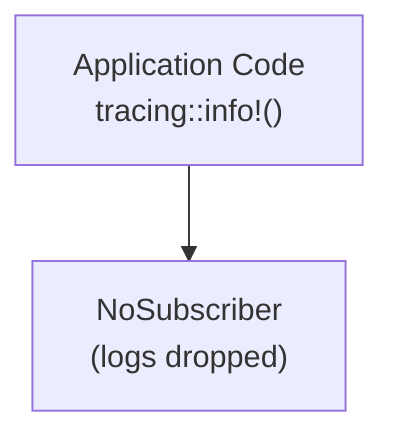
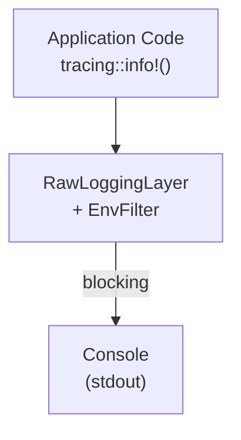
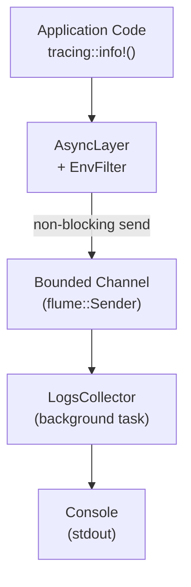
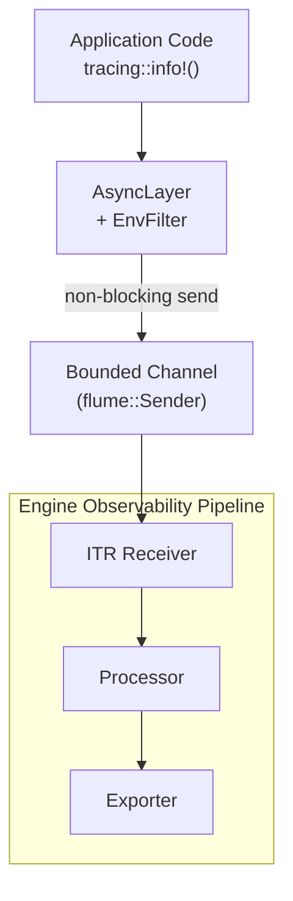
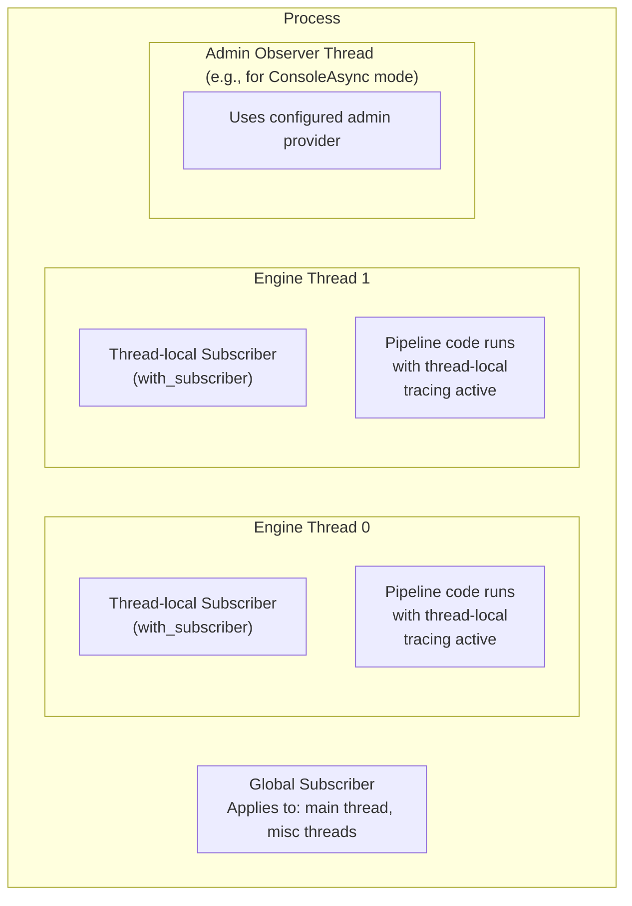

# Internal Telemetry System and Engine Observability Pipeline

This documents the choices available in the internal telemetry configuration.
See the
[internal telemetry crate's README](../crates/telemetry/README.md) for
the motivation behind this configuration and a description of the internal
metrics data path.

## Overview

The Internal Telemetry System (ITS) lets the engine safely consume its own
telemetry. The engine observability pipeline is the engine-managed dataflow
pipeline that receives ITS signals and routes them to processors and exporters.

Consuming self-generated telemetry presents a potential
feedback loop, situations where a telemetry pipeline creates pressure
on itself. We have designed for the OTAP dataflow engine to remain
reliable even with this kind of dependency on itself.

## Internal Telemetry Receiver (ITR)

The Internal Telemetry Receiver (ITR) is an OTAP-Dataflow receiver that consumes
logs from the ITS channel and metrics from the telemetry registry. The engine
observability pipeline contains exactly one connected ITR plus the processors
and exporters reachable from it.

Observability nodes use the same component model as ordinary pipeline nodes,
but the controller owns their lifecycle separately from user pipelines. The
pipeline runs on one dedicated thread and remains active while producer
pipelines finish reporting terminal telemetry.

## Logs instrumentation

The OTAP Dataflow engine provides dedicated `otel_info!`, `otel_warn!`,
`otel_error!`, and `otel_debug!` macros for primary instrumentation. The active
logging provider determines whether those events use ITS, direct or asynchronous
console output, or no output. Other uses of Tokio `tracing` are considered
third-party internal logging.

## Pitfall avoidance

The OTAP-Dataflow engine is safeguarded against many self-induced
telemetry pitfalls, as follows:

- The ITR is a source node, and the validated observability graph cannot route
  output back into it. This prevents a direct telemetry feedback cycle.
- A dedicated thread handles observability pipeline output.
- Tokio `tracing` subscribers are selected independently by execution context.
- Non-blocking interfaces. We prefer to drop and count dropped
  internal log events than to block the pipeline.
- Logging can use ITS, asynchronous or direct console output, or no output.

## OTLP-bytes first

As a key design decision, the OTAP-Dataflow internal telemetry data
path produces a partially encoded OTLP-bytes representation first.
This is an intermediate format,
`otap_df_telemetry::self_tracing::LogRecord`, which includes the
timestamp, callsite metadata, and the OTLP bytes encoding of the body
and attributes.

Because OTLP bytes is one of the builtin `OtapPayload` formats, it is
simple to get from a slice of `LogRecord` to the `OtapPayload` we need
to consume internal telemetry. To obtain the partial bytes encoding
needed, we have a custom [Tokio `tracing` Event][TOKIOEVENT] handler
based on `otap_df_pdata::otlp::common::ProtoBuffer`.

[TOKIOEVENT]: https://docs.rs/tracing/latest/tracing/struct.Event.html

## Raw logging

We support formatting events for direct printing to the console from
OTLP bytes. For the dynamic encoding, these are consumed using
`otap_df_pdata::views::logs::LogsDataView`, making the operation
zero-copy. We refer to this most-basic form of printing to the console
as raw logging because it is a safe configuration that avoids feedback
for internal logging.

Note: Raw logging is likely to introduce contention over the console.

In cases where internal logging code is forced to handle its own
errors, the `otap_df_telemetry::raw_error!` macro is meant for
emergency use, to report about failures to log.

## Logging provider modes

The logging configuration supports multiple distinct provider mode
settings:

- Global: The default Tokio subscriber, this will apply in threads
  that do not belong to an OTAP dataflow engine core.
- Engine: This is the default configuration for engine core threads.
- Admin: This is the configuration use in administrative threads.
- Internal: This is the default configuration for internal telemetry
  pipeline components.

Provider mode values are:

- Noop: Ignore logging.
- ITS: Use the internal telemetry system.
- ConsoleDirect: Synchronously write to the console.
- ConsoleAsync: Asynchronously write to the console.

Note that the ITS and ConsoleAsync modes share the same provider
logic, which writes to an internal channel. These modes differ in how
the channel is consumed.

## Provider Mode Diagrams

### Noop Provider

Logs are silently dropped. Useful for testing or disabling logging.


```mermaid
flowchart TB
    A["Application Code<br/>tracing::info!()"]
    B["NoSubscriber<br/>(logs dropped)"]
    A --> B
```

### ConsoleDirect Provider

Synchronous console output. Simple but may block the producing thread.


```mermaid
flowchart TB
    A["Application Code<br/>tracing::info!()"]
    B["RawLoggingLayer<br/>+ EnvFilter"]
    C["Console<br/>(stdout)"]
    A --> B
    B -->|blocking| C
```

### ConsoleAsync Provider

Asynchronous console output via a bounded channel. Non-blocking for
the producing thread; logs will be dropped if the channel is full.


```mermaid
flowchart TB
    A["Application Code<br/>tracing::info!()"]
    B["AsyncLayer<br/>+ EnvFilter"]
    C["Bounded Channel<br/>(flume::Sender)"]
    D["LogsCollector<br/>(background task)"]
    E["Console<br/>(stdout)"]
    A --> B
    B -->|non-blocking send| C
    C --> D
    D --> E
```

### ITS Provider (Internal Telemetry System)

Routes logs through the engine observability pipeline for self-hosted
telemetry consumption. Uses the same channel mechanism as ConsoleAsync
but consumed by the Internal Telemetry Receiver.


```mermaid
flowchart TB
    A["Application Code<br/>tracing::info!()"]
    B["AsyncLayer<br/>+ EnvFilter"]
    C["Bounded Channel<br/>(flume::Sender)"]

    subgraph ITP["Engine Observability Pipeline"]
        D["ITR Receiver"]
        E["Processor"]
        F["Exporter"]
        D --> E --> F
    end

    A --> B
    B -->|non-blocking send| C
    C --> D
```

## Internal metrics export

Internal metrics are updated in per-core metric sets on the hot path. A
collector snapshots those sets into the registry on the cold path. The
always-running internal telemetry receiver drains an independent export view of
the registry, encodes it as OTLP metrics, and sends it through the engine
observability pipeline. The built-in pipeline consumes these batches with a
noop exporter.

ITS keeps the admin endpoint and pipeline export isolated: an admin read or
reset does not consume values waiting for the receiver. The observability
pipeline must contain exactly one connected internal telemetry receiver, and
its non-empty `signals` list can independently select logs and metrics. When
metrics are omitted, the receiver still commits the private ITS export
accumulator without OTLP conversion or emission, preserving registry cleanup
and the admin accumulator. Optional `interval` and `views` settings control the
cold-path export when metrics are selected.

The bridge projects multivariate metric sets into standard univariate OTLP
metrics, so the observability pipeline can use normal OTLP or OTAP exporters.
This representation is transitional pending native multivariate metric-set
support in OTAP.

## Thread Model and Subscriber Scopes

The tracing subscriber can be configured at two scopes:

1. Global subscriber (`try_init_global`): Set once at startup,
   applies to all threads that do not use with_subscriber.
2. Thread-local subscriber (`with_subscriber`): Temporarily sets
   a subscriber for the duration of a closure. Used by engine threads.


```mermaid
flowchart TB
    subgraph Process
        subgraph Global["Global Subscriber<br/>Applies to: main thread, misc threads"]
        end

        subgraph ET0["Engine Thread 0"]
            TL0["Thread-local Subscriber<br/>(with_subscriber)"]
            PC0["Pipeline code runs<br/>with thread-local<br/>tracing active"]
        end

        subgraph ET1["Engine Thread 1"]
            TL1["Thread-local Subscriber<br/>(with_subscriber)"]
            PC1["Pipeline code runs<br/>with thread-local<br/>tracing active"]
        end

        subgraph Admin["Admin Observer Thread<br/>(e.g., for ConsoleAsync mode)"]
            AD["Uses configured admin provider"]
        end
    end
```

## Default configuration

By default, global and engine logs use ConsoleAsync, preserving the established
observed-state-store console path. The built-in observability pipeline still
provides a styled console route when the global or engine provider explicitly
selects ITS.
The same receiver always handles internal metrics, which the default pipeline
routes to the noop exporter. Admin logs use synchronous console output and
internal-pipeline logs are disabled to avoid feedback.

```yaml
version: otel_dataflow/v1
engine:
  telemetry:
    logs:
      level: info
      providers:
        global: console_async
        engine: console_async
        admin: console_direct
        internal: noop
groups:
  default:
    pipelines:
      main:
        nodes:
          # pipeline nodes
        connections:
          # pipeline connections
```

## Internal Telemetry Receiver configuration

In this configuration, the `InternalTelemetryReceiver` node consumes internal
logs and registry-backed metrics and emits OTLP pdata into the engine
observability pipeline. The internal log provider is configured to print
directly to the console in case that pipeline experiences errors.

```yaml
version: otel_dataflow/v1
engine:
  telemetry:
    logs:
      level: info
      providers:
        global: its
        engine: its
        admin: noop
        internal: console_direct
  observability:
    pipeline:
      nodes:
        telemetry:
          type: receiver:internal_telemetry
          config:
            metrics: {}
        otlp_grpc_exporter:
          type: exporter:otlp_grpc
          config: {}
      connections:
        - from: telemetry
          to: otlp_grpc_exporter
groups:
  default:
    pipelines:
      main:
        nodes:
          # normal pipeline nodes
        connections:
          # normal pipeline connections
```
