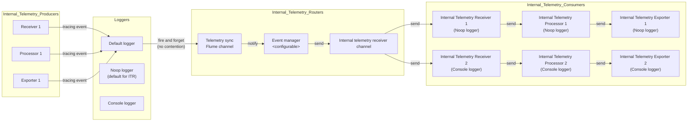

# Implementing engine self tracing as telemetry production and consumption responsibility segregation.

The internal telemetry is separated into the telemetry production in one side and the telemetry routing and consumption in another side. Both pieces are connected through a flume async channel.

## Internal Telemetry producers

Any node in the engine (receivers, processors, exporters) with access to the effect handler where the logger resides.

They produce the telemetry and send it through its configured logger.

## Loggers

**Default logger**: Sends the telemetry to the telemetry sync flume channel as "fire and forget". It does not add contention in the process.

This is the default logger for all components.

**Noop logger**: Ignores any call for telemetry publishing. Does nothing.

This logger is configured as default for the internal telemetry receiver and all its subsequent nodes.

**Console logger**: Prints to the console any telemetry received. It creates contention. It can be configured as an alternative to override the Noop default for the internal telemetry pipeline to debug it.

## Internal Telemetry Routers

Includes the mechanism to configure and handle the internal telemetry routing.

## Internal Telemetry Consumers

Components that configure the internal telemetry pipeline.

Note that the components that are used as part of the internal telemetry pipeline are instances of the same nodes used on a regular pipeline. The difference is that the logger configured for them cannot be the default logger.

## Configuration points

The configuration points for this implementation are identified as:

**Node**: Every node in the graph can be configured to override the default logger. The internal telemetry receiver automatically configures itself to a logger that is not the default one.

**Internal Telemetry Router**: This component can be configured to have multiple instances of the consumer, multiple channels, size of its channels and behavior under high load (drop messages by default).
