# System events guide

This guide defines how to add **system events** for the OTAP engine. It
complements the [semantic conventions guide](semantic-conventions-guide.md) and
the [entity model](entity-model.md).

## Related guides

- Attribute policy (including attributes vs event body guidance):
  [Attributes Guide](attributes-guide.md)
- Stability model and compatibility rules for event schemas:
  [Stability and Compatibility Guide](stability-compatibility-guide.md)
- Sensitive data and stacktrace gating:
  [Security and Privacy Guide](security-privacy-guide.md)

## What events are for

Events are discrete occurrences that benefit from context and correlation but do
not need to be aggregated as metrics. In OTLP, the event name MUST be carried in
the LogRecord `event_name` field. Do not introduce new telemetry that sets
`event.name` as an attribute.

Use events to record:

- Controller/Pipeline actions (config reload, shutdown, ack, timer ticks).
- State transitions (batch flush, backpressure, queue full).
- Exceptional outcomes (errors, retries, drops).

If the signal is high-volume or needs aggregation, prefer metrics. If the
event is part of a dataflow trace, use a regular event with a trace ID, not a
span event record, as span events are
becoming [deprecated](https://github.com/open-telemetry/opentelemetry-specification/blob/main/oteps/4430-span-event-api-deprecation-plan.md).

Exception rule (traces):

- If you are recording an actual exception on a span, the regular event name
  MUST be `exception` and the standard exception attributes MUST be used.

## How to emit events in code

All events MUST be emitted using the `otel_*` macros from the
`otel_arrow_dfe_telemetry` crate. **Do not** use `tracing::info!`,
`log::info!`, or `println!` directly. This rule is enforced by
`scripts/check-direct-telemetry-macros.sh` (run in CI).

**Why wrappers instead of raw `tracing` macros?**

- **Mandatory event name.** The first argument to every `otel_*!` macro is the
  event name. Raw `tracing` macros do not require one, and their default name
  includes the file path and line number -- which is not durable and breaks
  filtering, alerting, and dashboards whenever code is moved or reformatted.
- **Automatic `target`.** Registered components use
  `<namespace>.<kind>.<name>`, derived from their registered URN; other code
  uses the Cargo package name. When exported via OTLP, this becomes
  `InstrumentationScope.name`.

### Available macros

| Macro | Severity |
| --- | --- |
| `otel_debug!` | DEBUG |
| `otel_info!` | INFO |
| `otel_warn!` | WARN |
| `otel_error!` | ERROR |

Registered components declare `otel_component_scope!` at their root module to
apply the component target to the module subtree. See the
[telemetry crate README](../../crates/telemetry/README.md#logging-macros).

### Basic usage

The first argument is always the **event name** (a string literal). Optional
key-value pairs follow as structured attributes.

```rust
use otel_arrow_dfe_telemetry::otel_info;

// Event name only (no attributes):
otel_info!("pipeline.run.start");

// Event name with attributes:
otel_info!("receiver.grpc.start",
    endpoint = %addr,
);
```

### The `message` attribute

Use an attribute named **`message`** when the event name alone is not sufficient
to convey what happened. This value is mapped to the OTel LogRecord **body**,
making it the primary text shown in log viewers, consoles, and observability UIs.

Not every event needs a `message` -- if the event name is self-explanatory,
omit it. Avoid messages that just restate the event name; they add no value.

```rust
// Bad -- message just restates the event name:
otel_info!("pipeline.run.start",
    message = "Pipeline run started",
);

// Good -- event name says it all, no message needed:
otel_info!("pipeline.run.start");

// Good -- message explains consequences beyond what the event name conveys:
otel_warn!("core_affinity.set_failed",
    message = "Failed to set core affinity for pipeline thread. \
        Performance may be less predictable.",
);
```

### Attribute formatting

The macros support `tracing`-style formatting hints:

- `%value` -- Display formatting (`fmt::Display`)
- `?value` -- Debug formatting (`fmt::Debug`)
- `value` -- passed directly (integers, booleans, etc.)

Avoid Debug-formatting (`?`) large or deeply nested structs at info/warn/error
severity -- break them into individual meaningful fields instead. For **error
values**, prefer `%` (Display) when the type has a well-crafted `Display` impl
(especially first-party `thiserror` types); `?` (Debug) is acceptable when
`Display` is too terse or unavailable. For **simple types** (enums, paths,
durations), either sigil is fine at any level.

```rust
otel_info!("node.connect",
    endpoint = %addr,
    count    = 42,
);

// BAD -- Debug-dumping a large nested struct at info level:
otel_info!("state.observed_event", observed_event = ?observed_event);

// GOOD -- break the struct into individual fields:
otel_info!("state.observed_event",
    pipeline_group_id = %observed_event.key.pipeline_group_id,
    pipeline_id = %observed_event.key.pipeline_id,
    core_id = observed_event.key.core_id,
    event_type = ?req,
    message = observed_event.message.as_deref().unwrap_or(""),
);

// Debug on simple enums or types without Display is fine at any level:
otel_info!("durable_buffer.shutdown.start", deadline = ?deadline);

// Full Debug formatting for complex types is best at debug level:
otel_debug!("node.connect",
    config = ?node_config,
);
```

## Consolidating events

Every `otel_*!` callsite adds to the binary's static metadata. Avoid
proliferating near-identical events that differ only by one attribute -- use a
single event with a distinguishing **attribute** instead.

### Use attributes for variation, not separate event names

When several code paths represent the same *kind* of occurrence and differ only
in a categorical dimension (status code, credential type, error class, etc.),
emit **one event** with that dimension as an attribute rather than creating a
separate event for each value.

```rust
// BAD -- four callsites for the same conceptual event:
otel_warn!("receiver.grpc.unauthenticated", status_code = 16, message = %msg);
otel_warn!("receiver.grpc.permission_denied", status_code = 7, message = %msg);
otel_warn!("receiver.grpc.unavailable", status_code = 14, message = %msg);
otel_warn!("receiver.grpc.resource_exhausted", status_code = 8, message = %msg);

// GOOD -- one callsite, status_code as an attribute:
otel_warn!("receiver.grpc.error",
    status_code = code,
    message = %msg,
);
```

### Consolidate one-time startup information

Informational events emitted once during initialization (e.g. credential type,
listening address, feature flags) SHOULD be folded into a single startup event
rather than emitted as dedicated events per field.

```rust
// BAD -- separate events for each piece of startup info:
otel_info!("exporter.start");
otel_info!("exporter.endpoint", endpoint = %endpoint);
otel_info!("exporter.auth_type", auth_type = %auth_type);

// GOOD -- single startup event with all relevant attributes:
otel_info!("exporter.start",
    endpoint = %endpoint,
    auth_type = %auth_type,
);
```

## Event naming

Event names MUST be low-cardinality and stable. Follow the
[semantic conventions guide](semantic-conventions-guide.md#event-naming) for
naming:

- Lowercase and dot-separated. It identifies a class of event, not an instance.
- Keep the name stable and "type-like". Treat it as a schema identifier.
- Use verbs for actions (e.g. `pipeline.config.reload`).
- Avoid embedding IDs or dynamic values in the name. Encode variability as
  attributes.
- Avoid synonyms that fragment cardinality across names (`finish` vs `complete`,
  `error` vs `fail`). Pick one verb set and stick to it.
- Use **distinct event names** for different outcomes of the same operation
  (e.g. `otlp.exporter.start.complete` and `otlp.exporter.start.fail`). Do not rely
  solely on severity to distinguish success from failure.

More precisely, in this project, event names SHOULD follow this pattern:
`otelcol.<entity>[.<thing>].<verb>`

Where:

- `otelcol.` is the project prefix/namespace used for events and other custom
  telemetry.
- `<entity>` is the primary entity involved (e.g. `pipeline`, `node`,
  `channel`). See the [entity model](entity-model.md) for the list of entities.
- `<thing>` is an optional sub-entity, subject, or stage (e.g. `build`, `run`,
  `receiver`, `exporter`).
- `<verb>` is the action or occurrence (e.g. `start`, `complete`, `fail`,
  `reload`, `shutdown`).

Note: OpenTelemetry Events are represented as LogRecords with an
[event name](https://github.com/open-telemetry/opentelemetry-specification/blob/v1.50.0/specification/logs/data-model.md#field-eventname).
In OTLP, this is carried in the LogRecord `event_name` field (not in the body).

## Attributes and context

Always attach the relevant entity attributes (stable context):

- Pipeline attributes for pipeline-level events.
- Node attributes for node-level events.
- Channel attributes for channel-related events.

Optionally, add occurrence-specific attributes (dynamic context):

- Prefer enums or stable categorical values whenever possible.
- Use standard exception attributes for errors (`exception.type`,
  `exception.message`). Stacktrace gating rules are in
  [Security and Privacy Guide](security-privacy-guide.md).
- Follow [Security and Privacy Guide](security-privacy-guide.md) to avoid
  sensitive data.

## Severity and placement

When events are exported as logs, set an appropriate severity.

Regarding severity, choose the log level that best reflects the significance of
the event. For example, `node.shutdown.complete` at INFO for a graceful
shutdown and `node.shutdown.fail` at ERROR for a critical failure -- these are
distinct events, not the same event at different severity levels.

## Stages

The following stages are recommended for event names:

- `pipeline`:
  - `build`: Pipeline construction phase.
  - `run`: Pipeline execution phase.
  - `report`: Pipeline metrics reporting phase.
- `node`:
  - `build`: Node construction phase.
  - `run`: Node execution phase.
- `channel`:
  - `send`: Channel send phase.
  - `recv`: Channel receive phase.

This list is not exhaustive. Choose stages that best describe the context while
maintaining clarity and consistency.

## Verbs

The following verbs are recommended for event names:

- `create`: The creation of an entity or resource.
- `init`: The initialization of an entity or resource.
- `start`: The beginning of an operation or process.
- `complete`: The successful end of an operation or process.
- `fail`: An operation or process that ended with an error.
- `stop`: The beginning of a stop or shutdown process.
- `pause`: The pausing of an operation or process.
- `resume`: The resumption of an operation or process.
- `apply`: An application of configuration or state.
- `flush`: A batch or buffer flush.
- `drop`: A drop occurrence.
- `backpressure`: A backpressure occurrence.
- `retry`: A retry attempt.
- `ack`: An acknowledgment occurrence.
- `nack`: A negative acknowledgment occurrence.
- `tick`: A timer tick occurrence.
- `sleep`: A sleep occurrence.
- `cancel`: An operation was intentionally stopped by an external decision
  before it finished. Triggered by a caller, operator, controller, or policy.
  Usually expected and often benign. Not an error in itself.
- `abort`: An operation was forced to stop due to an internal safety condition
  or unrecoverable state. Triggered inside the system. Indicates something went
  wrong or became unsafe. Usually unexpected.
- `timeout`: A timeout occurrence.

This list is not exhaustive. Choose verbs that best describe the action while
maintaining clarity and consistency. Avoid synonyms that fragment cardinality
across names. Don't introduce alternatives such as `finish` or `error`. Use
one success verb `complete`, one failure verb `fail`, one external
termination verb `cancel`, and one internal safety verb `abort`.

## Checklist for new events

- The event name follows the semantic conventions guide and the
  `otelcol.<entity>[.<thing>].<verb>` pattern.
- The event name is stable, low-cardinality, and contains no IDs or dynamic
  values.
- The event represents a discrete occurrence; use metrics instead for
  high-volume signals.
- Relevant entity attributes are included (pipeline/node/channel/etc).
- Dynamic attributes are bounded and avoid sensitive or high-cardinality data.
- Error events use standard exception attributes; stacktraces only at debug or
  lower.
- Severity is appropriate and consistent with the event meaning.
- No `format!` calls in attribute values; use `%`/`?` formatting or raw values.
- Near-identical events have been consolidated into a single event with a
  distinguishing attribute (see [Consolidating events](#consolidating-events)).
- The number of new callsites is minimized; each callsite adds static memory
  overhead.

## Repeated exporter failures

This shared policy is intended for adoption by all exporters. **Currently, only
the OTLP HTTP exporter implements it.** Integration with other exporters will
follow in future PRs.

The protocol-independent `export_diagnostics` helper reports observed export
behavior before events reach ITS, console providers, or the retained log tap.
This policy is independent of metric collection and does not change retries,
Ack/Nack routing, backpressure, or readiness.

The current OTLP HTTP integration emits these events:

- `otlp.exporter.http.export_error` (WARN): the first failed export of an
  episode and summaries at most once every 60 seconds while further failures
  are observed. `diagnostic_kind` distinguishes `first_failure` and `summary`.
- `otlp.exporter.http.export_recovered` (INFO, `diagnostic_kind = recovery`):
  an actual successful export after
  30 seconds without an observed failure. The successful operation must have
  started after the most recent failure; old in-flight successes cannot clear
  a newer failure.
- `otlp.exporter.http.notification_error` (WARN): independently bounded Ack/Nack
  routing failures, with `diagnostic_kind = first_failure` or `summary`.
- `otlp.exporter.http.preparation_error` (WARN): independently bounded encoding
  and compression failures, with `diagnostic_kind = first_failure` or `summary`.

Successful operation before the first failure is silent. Reports are evaluated
on completions, without probes or timers. Idle periods produce no new reports
and do not establish recovery. A success can trigger a summary only when there
are unreported failures and recovery has not been confirmed. Changing error
categories does not restart an episode or bypass the summary interval.

### Delivery episodes

An episode begins with the first failed export and ends with confirmed recovery.
The diagram shows the shared delivery logic, currently used by OTLP HTTP, for
one exporter instance/core, signal, and configured destination.

```mermaid
stateDiagram-v2
    [*] --> Unknown

    Unknown --> Delivering: Success / no log
    Unknown --> Degraded: First failure / open episode, WARN
    Delivering --> Degraded: First failure / open episode, WARN

    Degraded --> Degraded: Completion without confirmed recovery
    Degraded --> Delivering: Confirmed recovery / INFO, clear episode

    note right of Degraded
        Count every completion in interval + episode totals.
        First failure or summary due: WARN, reset interval only.
        Otherwise: no log; count suppressed failures.
        Episode totals remain until recovery.
    end note
```



- **Bounded volume:** the first failure emits a WARN. Further WARN summaries
  require a completion, unreported failures, and at least 60 seconds since the
  last report. Recovery takes priority over a due summary. Suppression happens
  before log subscribers receive events.
- **Accurate counts:** while an episode is active, every success or failure is
  counted before reporting in both interval counters and episode totals.
  Failures also update error-category counts and, when no warning is emitted,
  suppressed counts. Each report resets interval counters only; recovery
  includes its triggering success in the final totals, then clears the episode.
- **Recovery:** every failure restarts the 30-second failure-free window.
  Recovery also requires a successful attempt started after the latest failure.
  Idle time alone produces no reports or state changes.

### Scope and boundaries

State is local to an OTLP HTTP exporter instance/core, signal, and configured
destination. Success for one signal cannot clear failures for another signal,
including when signal-specific endpoints are configured.

The `stage` attribute distinguishes delivery, preparation, and notification
observations. Preparation and notification errors use independent failure
summaries and cannot mark a destination recovered. Delivery observations come
from completed HTTP exports before Ack/Nack routing. Partial acceptance and
permanent rejection remain failed attempts with their existing classifications;
an upstream notification failure cannot change the observed HTTP outcome.

### Report fields

All events keep the component's instrumentation target and pipeline/node
context. The fields describe observations, not unique batches or data loss:

| Field | Meaning |
| --- | --- |
| `diagnostic_kind` | `first_failure`, `summary`, or `recovery` |
| `signal`, `stage` | Signal and observed operation boundary |
| `episode_seconds` | Time since the initial observed failure |
| `interval_seconds` | Time since the previous report |
| `successful_attempts`, `failed_attempts` | Counts since the previous report |
| `suppressed_diagnostics` | Failures not individually logged in that interval |
| `total_successful_attempts`, `total_failed_attempts` | Counts for the episode |
| `total_suppressed_diagnostics` | Suppressed failures for the episode |
| `error_counts`, `total_error_counts` | Bounded `category=count` lists |
| `error_sample_age_seconds` | Age of the representative failure |

Delivery errors retain the legacy string `message` and boolean `retryable`.
Both describe the representative failure, not all failures in the interval;
retryability uses the same authentication-aware decision as Nack routing.
Notification errors retain the legacy Ack/Nack-specific `message` and `error`
sample. Preparation errors have a descriptive `message` and an `error` sample.
Recovery events have a recovery `message`, the retained `error` sample and its
age, and episode totals; they omit `retryable`.

The first report includes its triggering failure. Later reports include the
current observation and exclude observations already covered by earlier
reports. Error text is formatted only when a failure report is selected,
escaped for single-line display, and retained up to 1024 UTF-8 bytes.
Success-triggered summaries reuse the previous representative error, its
retryability, and its age. Recovery reuses the error and its age.
Callers must still redact sensitive data before supplying diagnostic text.

Existing HTTP export and notification error event names are preserved, so
error-event filters do not need renaming. Log frequency intentionally decreases;
use existing attempt and failure metrics for rates and impact. The shared
emission helper emits common fields with the event name and severity chosen by
the exporter. The exporter-owned error categories,
metric counts, and retry/permanent decisions remain unchanged. One process may
emit several reports for an outage because cores and signals are independent.
