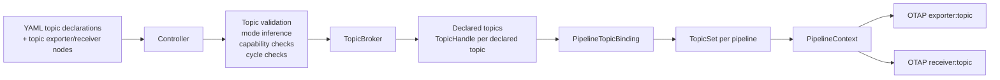
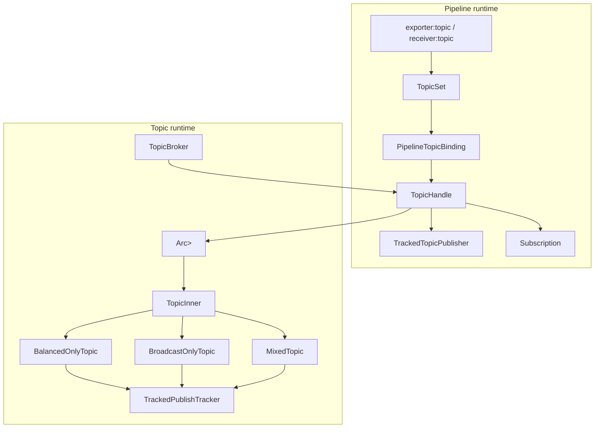
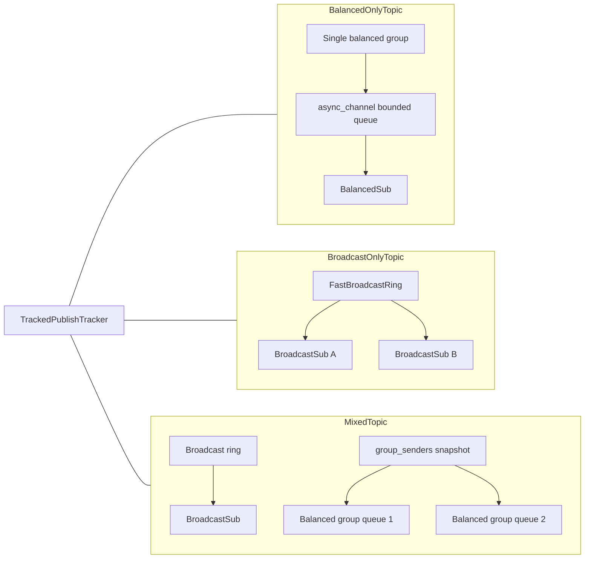
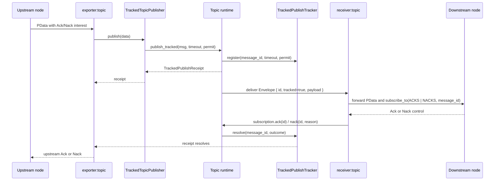

# Topic Architecture

This document summarizes how the topic system fits into the engine and how the
current in-memory topic runtime is structured internally.

## Scope

The diagrams below focus on four things:

- startup-time integration with config and controller logic
- runtime layering from pipeline nodes down to backend state
- in-memory delivery structures for balanced, broadcast, and mixed topics
- tracked publish and Ack/Nack propagation across a topic hop

## 1. Startup Integration

### Startup Highlights

- The controller owns topic declaration and startup validation.
- Topic mode is inferred from actual topic usage and then mapped into
  `TopicOptions`.
- Capability validation and topic-wiring cycle detection happen before topic
  creation.
- Each pipeline receives a `TopicSet` containing `PipelineTopicBinding`
  instances, not raw broker state.

## 2. Runtime Layering

### Runtime Highlights

- `TopicHandle` is the pure runtime API.
- `PipelineTopicBinding` adds pipeline-scoped defaults such as
  `queue_on_full` and `ack_propagation.mode`.
- `TrackedTopicPublisher` is layered on top of `TopicHandle` and adds
  bounded in-flight tracked publishes.
- The broker stores backend-erased `TopicState<T>` instances.
- The current in-memory backend is selected through `TopicInner`, which picks
  one of the three runtime implementations.
- `TrackedPublishTracker` is the shared tracked-outcome mechanism used by the
  in-memory topic variants.

## 3. In-Memory Topic Structures

### Structure Highlights

- Balanced delivery uses bounded async queues per consumer group.
- Broadcast delivery uses a single ring buffer with per-subscriber cursors.
- Mixed topics combine both structures in one topic instance.
- All three variants share the same tracked publish tracker for tracked
  outcome resolution.

## 4. Tracked Publish and Ack/Nack Flow

### Flow Highlights

- The exporter keeps the original upstream `PData` until the tracked receipt
  resolves.
- The topic runtime, not the exporter, owns tracked publish outcome state.
- `max_in_flight` is enforced before entering the topic runtime.
- The timeout belongs to the tracked publish contract and is applied after the
  topic accepts the publish.

## Notes and Current Limits

- Topic wiring across pipelines must remain acyclic. Startup rejects both
  same-pipeline feedback through topics and multi-pipeline topic loops.
- In broadcast mode, `ack_propagation.mode: auto` still uses
  first-subscriber-wins semantics today; it does not wait for all broadcast
  subscribers to Ack/Nack.
- Topic-owned gauges for balanced group count and broadcast subscriber count
  are still future work. Current metrics live on the topic exporter and topic
  receiver nodes.
