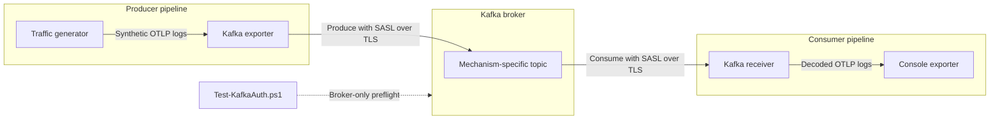

# Kafka SASL over TLS Local Validation

This example validates the otel-arrow Kafka exporter and receiver against a
real Kafka broker. It sends OTLP protobuf logs through three independent
SASL-over-TLS pipelines:

| Mechanism | Topic | Consumer group |
| --- | --- | --- |
| `PLAIN` | `otlp-logs-plain` | `otap-plain-consumer` |
| `SCRAM-SHA-256` | `otlp-logs-scram-256` | `otap-scram-256-consumer` |
| `SCRAM-SHA-512` | `otlp-logs-scram-512` | `otap-scram-512-consumer` |

## End-to-End Validation Flow

The configuration runs this path independently for `PLAIN`, `SCRAM-SHA-256`,
and `SCRAM-SHA-512`:



- **Traffic generator** (`receiver:traffic_generator`) is the dataflow source.
  It creates synthetic logs at five signals per second, up to 20 signals per
  mechanism.
- **Producer pipeline** groups the traffic generator and Kafka exporter. It is
  a pipeline name, not a separate runtime component.
- **Kafka exporter** (`exporter:kafka`) encodes the generated logs as OTLP
  protobuf and produces them to the mechanism-specific topic using SASL over
  TLS.
- **Kafka broker** is the real Confluent Kafka instance started by Docker
  Compose. Its authenticated client listener is available at
  `localhost:9093`.
- **Kafka topic** separates the messages for each mechanism so every path can
  be verified independently.
- **Consumer pipeline** groups the Kafka receiver and console exporter. Like
  the producer pipeline, it describes node composition and connections.
- **Kafka receiver** (`receiver:kafka`) authenticates with Kafka, joins the
  configured consumer group, reads the matching topic, and decodes the OTLP
  protobuf messages.
- **Consumer group** tracks the receiver's committed offsets. A lag of zero
  proves that the receiver consumed all messages produced to its topic.
- **Console exporter** (`exporter:console`) prints the decoded logs, proving
  that telemetry reached the end of the otel-arrow pipeline.
- **Broker authentication test** (`Test-KafkaAuth.ps1`) verifies the broker's
  three SASL-over-TLS handshakes before otel-arrow starts. It is a preflight
  check and is not part of the dataflow path.

The fixed credentials and generated certificates are for local development
only.

## Prerequisites

- Docker Desktop using Linux containers
- The Rust toolchain specified by this repository
- Visual Studio 2022 or Build Tools with the **Desktop development with C++**
  workload
- Python with the `libclang` package
- vcpkg with `openssl:x64-windows-static-md`

Run all commands below from **Developer PowerShell for Visual Studio**. Start
in the repository root and define the example paths once:

```powershell
Set-Location rust/otap-dataflow
$ComposeFile = "examples/kafka-sasl-tls/compose.yaml"
$DataflowConfig = "examples/kafka-sasl-tls/kafka-sasl-tls.yaml"
```

### Prepare the Windows Build Environment

Install the Python `libclang` package into the repository virtual environment
if it is not already available:

```powershell
$RepoPython = Resolve-Path "..\..\.venv\Scripts\python.exe" `
  -ErrorAction SilentlyContinue
$Python = if ($RepoPython) {
  $RepoPython.Path
} else {
  (Get-Command python -ErrorAction Stop).Source
}
& $Python -m pip install libclang
```

Resolve `libclang.dll` from that environment and configure bindgen:

```powershell
$LibClangDll = & $Python -c @"
import pathlib
import clang
print(next(pathlib.Path(clang.__file__).parent.rglob("libclang.dll")))
"@

$Env:LIBCLANG_PATH = Split-Path -Parent $LibClangDll
if (-not (Test-Path "$Env:LIBCLANG_PATH\libclang.dll")) {
  throw "libclang.dll was not found in the repository virtual environment."
}
Write-Host "LIBCLANG_PATH=$Env:LIBCLANG_PATH"
```

When the repository virtual environment is present, this resolves to
`<repository>\.venv\Lib\site-packages\clang\native`.

Bootstrap a user-local vcpkg installation if `vcpkg.exe` is not available:

```powershell
$VcpkgRoot = "$Env:USERPROFILE\vcpkg"

if (-not (Test-Path "$VcpkgRoot\vcpkg.exe")) {
    if (-not (Test-Path "$VcpkgRoot\bootstrap-vcpkg.bat")) {
        git clone --depth 1 https://github.com/microsoft/vcpkg.git $VcpkgRoot
    }
    & "$VcpkgRoot\bootstrap-vcpkg.bat" -disableMetrics
}
```

Install OpenSSL and configure the current Developer PowerShell session:

```powershell
& "$VcpkgRoot\vcpkg.exe" install openssl:x64-windows-static-md

$Env:VCPKG_ROOT = $VcpkgRoot
$Env:VCPKG_INSTALLATION_ROOT = $VcpkgRoot
$Env:OPENSSL_DIR = "$VcpkgRoot\installed\x64-windows-static-md"
$Env:OPENSSL_ROOT_DIR = $Env:OPENSSL_DIR
$Env:OPENSSL_USE_STATIC_LIBS = "TRUE"

Test-Path "$Env:LIBCLANG_PATH\libclang.dll"
Test-Path "$Env:OPENSSL_DIR\include\openssl\ssl.h"
Test-Path "$Env:OPENSSL_DIR\lib\libssl.lib"
Test-Path "$Env:OPENSSL_DIR\lib\libcrypto.lib"
```

All four checks must print `True`. Set these environment variables again when
using a new Developer PowerShell session.

## Start Kafka

Start Docker Desktop and wait until it reports that the engine is running.
Then validate the Compose file and start the broker:

```powershell
docker version
if ($LASTEXITCODE -ne 0) {
  throw "Docker Desktop is not ready."
}

docker compose -f $ComposeFile config --quiet
if ($LASTEXITCODE -ne 0) {
  throw "Compose validation failed."
}

docker compose -f $ComposeFile up -d --wait kafka
if ($LASTEXITCODE -ne 0) {
  throw "Kafka startup failed."
}

docker compose -f $ComposeFile run --rm kafka-init
if ($LASTEXITCODE -ne 0) {
  throw "Kafka initialization failed."
}

docker compose -f $ComposeFile ps
$RunningServices = @(
  docker compose -f $ComposeFile ps --status running --services
)
if ($LASTEXITCODE -ne 0 -or $RunningServices -notcontains "kafka") {
  throw "Kafka is not running."
}
```

The startup generates a local CA and broker certificate, creates the SCRAM
users, and creates all three topics. The broker exposes its authenticated
listener at `localhost:9093`.

## Check Broker Authentication

Verify that the broker accepts each SASL mechanism through its TLS listener:

```powershell
& ./examples/kafka-sasl-tls/scripts/Test-KafkaAuth.ps1
```

Expected output:

```text
PASS: PLAIN over TLS - localhost:9093 ...
PASS: SCRAM-SHA-256 over TLS - localhost:9093 ...
PASS: SCRAM-SHA-512 over TLS - localhost:9093 ...
```

This is a broker-only check using Kafka's client tools. The next steps validate
the otel-arrow exporter and receiver.

## Run the Dataflow

The native build variables are scoped to the current PowerShell process. If
this is a new Developer PowerShell session, repeat the environment-variable
setup under **Prepare the Windows Build Environment**. Verify the required
files immediately before running Cargo:

```powershell
$RequiredBuildFiles = @(
  "$Env:LIBCLANG_PATH\libclang.dll"
  "$Env:OPENSSL_DIR\include\openssl\ssl.h"
  "$Env:OPENSSL_DIR\lib\libssl.lib"
  "$Env:OPENSSL_DIR\lib\libcrypto.lib"
)

$RequiredBuildFiles | ForEach-Object {
  if (-not (Test-Path $_)) {
    throw "Required build file not found: $_"
  }
}
```

First validate the six-pipeline configuration:

```powershell
cargo run `
  --features "kafka-receiver,otap-df-contrib-nodes/kafka-exporter" `
  -- `
  --config $DataflowConfig `
  --validate-and-exit
```

Then start the dataflow and capture its console output:

```powershell
Remove-Item kafka-sasl-tls.log -ErrorAction SilentlyContinue

cargo run `
  --features "kafka-receiver,otap-df-contrib-nodes/kafka-exporter" `
  -- `
  --config $DataflowConfig `
  --num-cores 1 2>&1 | `
  Tee-Object -FilePath kafka-sasl-tls.log
```

Each traffic generator publishes OTLP logs through its Kafka exporter. The
matching Kafka receiver consumes and decodes the logs, then sends them to a
console exporter. Keep this terminal running during the checks below.

## Verify End-to-End Delivery

Open another PowerShell terminal from `rust/otap-dataflow`. First verify that
all three receivers acquired their topic partitions and that the console
exporters emitted decoded telemetry:

```powershell
$LogFile = "kafka-sasl-tls.log"
$ReceiverPipelines = @(
  "plain-consumer"
  "scram-256-consumer"
  "scram-512-consumer"
)

$ReceiverPipelines | ForEach-Object {
  $Pattern = "partitions_assigned.*pipeline.id=$([regex]::Escape($_))"
  if (-not (Select-String -Path $LogFile -Pattern $Pattern -Quiet)) {
    throw "No Kafka partition assignment found for $_."
  }
  Write-Host "PASS: $_ acquired its Kafka partition"
}

if (-not (Select-String -Path $LogFile -Pattern "RESOURCE" -Quiet) -or
  -not (Select-String -Path $LogFile -Pattern "SCOPE" -Quiet)) {
  throw "No decoded telemetry found in $LogFile."
}
Write-Host "PASS: console exporters emitted decoded telemetry"
```

Console output from concurrent pipelines is interleaved and does not label
each decoded batch with its source pipeline. The partition-assignment checks
identify all three receivers; the next check proves that each receiver consumed
through the end of its topic.

Inspect all three consumer groups:

```powershell
$ComposeFile = "examples/kafka-sasl-tls/compose.yaml"
$ConsumerGroups = @(
  @{ Group = "otap-plain-consumer"; Topic = "otlp-logs-plain" }
  @{ Group = "otap-scram-256-consumer"; Topic = "otlp-logs-scram-256" }
  @{ Group = "otap-scram-512-consumer"; Topic = "otlp-logs-scram-512" }
)

$ConsumerGroups | ForEach-Object {
  $Output = docker compose -f $ComposeFile exec -T kafka `
    kafka-consumer-groups --bootstrap-server kafka:29092 `
    --describe --group $_.Group
  $Output | Write-Host

  $GroupPattern = "^$([regex]::Escape($_.Group))\s+$([regex]::Escape($_.Topic))\s+"
  $Row = $Output | Where-Object { $_ -match $GroupPattern } |
    Select-Object -Last 1
  if (-not $Row) {
    throw "No offset row found for $($_.Group)."
  }

  $Columns = $Row -split "\s+"
  if ($Columns[3] -ne $Columns[4] -or $Columns[5] -ne "0") {
    throw "$($_.Group) has not consumed through its topic end."
  }
  Write-Host "PASS: $($_.Group) reached offset $($Columns[3]) with zero lag"
}
```

The validation succeeds when:

- All four log checks print `PASS`.
- All three consumer-group checks print `PASS`.

If the dataflow is stopped before checking the groups, Kafka may report that a
group has no active members. This is expected; committed offsets and zero lag
remain valid delivery evidence. Stop the dataflow with `Ctrl-C` after
verification.

## Troubleshooting

- `Unable to find libclang`: verify that `LIBCLANG_PATH` contains
  `libclang.dll`.
- `Could NOT find OpenSSL`: verify that `OPENSSL_ROOT_DIR` points to the vcpkg
  `x64-windows-static-md` installation.
- Native compiler or CMake errors: run Cargo from Developer PowerShell for
  Visual Studio.

Inspect the container logs:

```powershell
docker compose -f $ComposeFile logs --no-log-prefix kafka
docker compose -f $ComposeFile logs --no-log-prefix certgen
```

To regenerate the certificates and broker state:

```powershell
docker compose -f $ComposeFile down -v
Remove-Item -Recurse -Force examples/kafka-sasl-tls/certs -ErrorAction SilentlyContinue
docker compose -f $ComposeFile up -d --wait kafka
docker compose -f $ComposeFile run --rm kafka-init
```

## Clean Up

```powershell
docker compose -f $ComposeFile down -v
Remove-Item -Recurse -Force examples/kafka-sasl-tls/certs -ErrorAction SilentlyContinue
Remove-Item kafka-sasl-tls.log -ErrorAction SilentlyContinue
```
