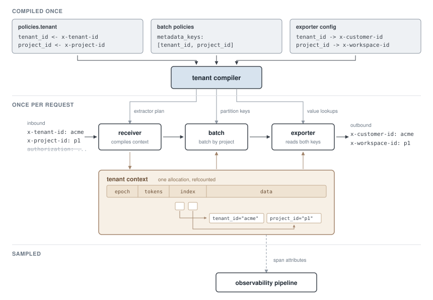

# Tenant Context

**Status:** Draft

## Overview

This document defines **tenant context** as the defining property of
the OTAP DFE request carrying request-specific metadata including:

- Peer network address
- Transport headers
- Authorized identity information
- Idempotency keys

Tenant contexts are efficiently encoded and carried by reference-counted
bytes.  Multitenant features are provided for producers and consumers
of tenant context:

- Producers use standard engine methods to enter metadata associated
  with a new request, yielding a new tenant context.
- Consumers use standard engine methods to match by or retrieve tenant
  variables.

Multitenant features are implemented by a **tenant compiler** which is
computed from the whole engine configuration. The tenant compiler
internalizes strings and match conditions and computes hash codes for
distinct token signatures. The goal of this design is to enable `O(1)`
match operations; the initial implementation does not support
conditional matching, as described in the implementation plan below.

## Configuration model

Taken alongside a DFE pipeline configuration, the tenant context
defines a parallel metadata pipeline where extraction and application
of key metadata are configured and controlled by the user. Metadata
variables are each an aspect of the tenant context belonging to one or
more tenant tokens that are used for matching and propagating metadata
in the pipeline.

A **tenant key** is one key and value belonging to a tenant context.

An **extractor** produces one tenant key. Extractors are conditional;
they can fail to match.

A **tenant token** is one set of tenant keys, defined when a list of
extractors all match.

A **tenant condition** is a precomputed matcher for a set of keys and
optional values that callers can quickly evaluate over a tenant
context.

In most cases, tenant context behavior will be specified entirely
through policies, where tenant extractors and ingress rules are
expressed. Policies inform the engine that a combination of tenant
keys translates into a per-tenant configuration, generally, so that
`batch_processor` does not need to know how it is being used with
multiple tenants. Only in a few cases, such as the topic exporter and
receiver, and a new processor named `tenant_router`, does the
configuration directly refer to tenant values by key.

### Producers

Receivers and processor nodes that create new contexts will use engine
methods configured through `tenant` policies, listing tokens and
extractors, defining the keys:

```yaml
policies:
  tenant:
    tokens:
      edge:
        extractors:
          - key: tenant_id
            transport_header: x-tenant-id
          - key: project_id
            transport_header: x-project-id
```

We emphasize transport headers in this document because at the time of
writing, transport headers are encoded using
`Option<Arc<Vec<TransportHeader>>>`. This design will replace the
implementation of transport headers with tenant context, a
reference-counted `Bytes`. Then, using scratch space to construct
tenant tokens, we will reduce the number of allocations to one per
tenant context.

Receivers evaluate their required and optional tenant tokens, optional
when they may be present and required when they must be present.

```yaml
nodes:
  ingest:
    type: receiver:otlp
    policies:
      ingress:
        optional_tokens: [edge]
    config:
      ...
```

Receivers are expected to handle missing required tokens in a protocol
specific way, for example the gRPC code `FAILED_PRECONDITION` or HTTP
403 `Forbidden`. Other nodes with missing required tokens will
automatically Nack requests, and other configurations can be added
through policies.

### Trust boundary

The engine governs the use of tenant context to enforce type-correct
use of extractors. Authorization extensions that implement recognized
authorization capabilities are able to produce the
`AuthorizedIdentity` struct used in authorization
extractors. Authorization claims will not be able to be produced from
transport headers directly, they must be produced by authorization
extensions.

```yaml
policies:
  tenant:
    tokens:
      auth_subject:
        extractors:
          - key: user_id
            authorized_key: sub
            retain: false
```

Specific `authorized_key` extractor semantics are out of scope in this
document. While the tenant context uses a packed `Bytes`
representation, it retains logical separation of its independent
components to maintain type safety. Consumers will be able to extract
authorized key information separately from transport headers, peer
address, and other attributes.

### Consumers

Consumers of the tenant context fall into two categories:

- Carriers: Consumers have the general ability to extract values from
  tenant context by key.
- Matchers: Consumers have the general ability to form conditions on
  tenant context, either in configuration or in runtime data structures.

As an example of the carrier pattern, the gRPC OTLP exporter can be
configured to export specific tenant keys:

```yaml
nodes:
  backend:
    type: exporter:otlp_grpc
    config:
      grpc_endpoint: http://backend:4317
      tenant_headers:
        - key: tenant_id
          header: x-customer-id
        - key: project_id
          header: x-workspace-id
```

In this example, the tenant compiler knows that tenant headers must be
carried in the tenant context, so that callers are able to reproduce
the values of `tenant_id` and `project_id`. In the example above, the
tenant token is not required, so the `x-customer-id` header will be
absent when the tenant key is undefined.

As an example of the matcher pattern, a new `tenant_router` processor
will be introduced to route by tenant context variables. The first
branch ("priority") is taken when the `tenant_id` equals "acme". The
second branch is taken when there is any `tenant_id` defined.

```yaml
nodes:
  route:
    type: processor:tenant_router
    policies:
      ingress:
        required_tokens: [edge]
    outputs:
      - priority
      - shared
    config:
      routes:
        - entries:
            - key: tenant_id
              value: acme
          port: priority
        - entries:
            - key: tenant_id
          port: shared
```

### Matching

The tenant compiler computes hash codes enabling a fast lookup and
equality mechanism. The tenant compiler determines a **token
signature** which is the set of tenant tokens used in a condition. For
each signature it computes:

- Hashcode: a hashcode joined from the set of values in the signature
- Indices: the offset in the tenant context for the interned value 
  identity or encoded literal value.

Nodes will resolve tenant conditions at startup or whenever their
configuration changes.

### Propagation

Tenant context propagates with each request. Like the associated
request data, tenant context can be cheaply cloned. Some nodes will
implement specific translation of tenant context. This may be done
however they see fit, for example, the batch processor can be
configured using tenant context, first by listing required tenant
tokens, then the set of metadata keys it partitions by.

```yaml
policies:
  tenant:
    tokens:
      batched:
        propagate_keys: [tenant_id, project_id]
nodes:
  batch:
    type: processor:batch
    policies:
      ingress:
        required_tokens: [edge]
        partition_keys: [tenant_id, project_id]
        max_cardinality: 100
      egress:
        required_tokens: [batched]
    config:
      ...
```

In general, nodes that combine many tenant contexts into one will be
forced to reset the tenant context. These nodes will require explicit
policy configuration to avoid empty tenant contexts. This requires the
nodes to call tenant-context construction utility functions in the
engine, that will take several forms:

- For receiver nodes, call the utility function providing borrowed 
  transport headers, peer network address, and authorized identity.
- For processor nodes that extend a single tenant context, call the
  utility function providing the original and the derived values.
- Processor nodes that combine multiple tenant contexts must use the
  `partition_keys` mechanism, the engine automatically constructs
  egress tokens from the projection of the partition keys.

Nodes may require tenant tokens even when they do not use them, for
example to declare an idempotency key that can be required by the
recipient:

```yaml
policies:
  tenant:
    tokens:
      idempotent:
        extractors:
          - key: idem
            idempotency: uuid7
```

```yaml
nodes:
  buffer:
    type: processor:durable_buffer
    policies:
      ingress:
        required_tokens: [edge, idempotent]
    config:
      ...
```

## Tenant compiler

The tenant compiler hides the details involved in evaluating and
applying tenant contexts. The engine uses the graph of nodes and
policies defined for each, then it precomputes all the necessary
information for fast evaluation:

- Compute a tenant context from the inputs
- Match a condition over tenant context variables
- Extract a value from a tenant context variable.

Tenant contexts are computed for the set of reachable nodes in a
pipeline. The compiler knows which variables are extracted and which
are only matched. Tenant variables can be "bagged" for extraction as a
list of key:values, encoding using OTLP bytes. The bagged section of
the tenant context can be borrowed as `&[u8]` for encoding
OpenTelemetry attributes directly from the tenant context.

The tenant compiler determines what information is necessary to
include in the tenant context, for example:

- Transport headers that are not referenced or bagged will be dropped
- Static configuration strings are replaced by numeric identifiers
- Tenant key names are compiled out, used only when bagged
- Tenant key values are hashed and/or canonicalized

The topic exporter and receiver will be extended with dedicated
configuration for controlling the propagation of tenant context across
pipeline group boundaries.

### Live reconfiguration

Live reconfiguration of the tenant compiler will be supported. Tenant
producer and consumer configuration are paired, when either changes
both sides will be recompiled and reconfigured. Consumer
reconfiguration events will be distributed ahead of producer
reconfiguration events. The tenant context carries state to indicate
which version of the compiler was used as an epoch number.

In some cases, live reconfiguration will be possible without
restarting a pipeline, for example to add a new tenant condition.  In
other cases, it will require a draining or flushing procedure to
remove tenant epochs from memory.

Components that use tenant conditions will require changes to support
this mode of live reconfiguration, as it means multiple
tenant-compiler epochs can be in-use concurrently. Orchestration may
be required to achieve. Components that use tenant conditions are
expected to fail requests that refer to an unknown tenant compiler
epoch. A coarse epoch timeout mechanism may be sufficient.

## Transport headers

The first deliverable in the timeline below, where tenant context is
used in the pipeline, will be a re-implementation of transport headers
in the DFE. The diagram explains how the tenant compiler works, with a
tenant context producer and two consumers illustrating the process.



Conditional matching is not supported in the initial step. Moving
forward, the ability to match based on tenant token values will
introduce new fields in the encoded tenant context implementing a
`O(1)` hash-function-based lookup.

## PR series

Tenant context will be implemented in approximately 10 PRs.

| PR | Main feature                | Main development                                                |
|----|-----------------------------|-----------------------------------------------------------------|
| 1  | Tenant Compiler             | Intern strings, index values, compute bagged encoding           |
| 2  | Transport header extractors | Map request context, transport header policy into tenant tokens |
| 3  | Propagation                 | Tenant context travels with request context                     |
| 4  | Carriers                    | Tenant consumers can extract key values                         |
| 5  | Remove transport headers    | Net-negative cost compared with starting point                  |
| 6  | Authorization               | New extractors for authorization subject/audience/claims        |
| 7  | Matchers                    | Compiler computes hash-join value array, adds tenant_router     |
| 8  | Topics                      | Topic exporter and receiver use special extractors              |
| 9  | Batch processor             | Batch processor gains partition keys                            |
| 10 | Ingress rules               | Required token checking, idempotency key support                |

Note that a PR5, when transport headers are removed, we will have
implemented the complete equivalent functionality compared with the
existing mechanism.

At this point, many more nodes will come up for review, and how we
design the use of tenant tokens for matching and propagation will
be extended to most of the remaining components as separate issues.
